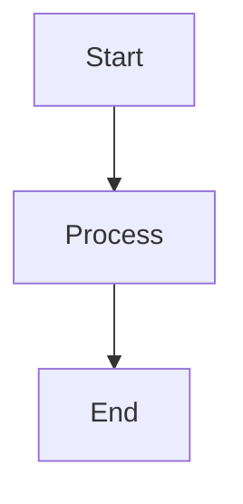

# Setup Guide for Discovering Ben MkDocs Site

This guide will help you set up and run the MkDocs site locally.

## Prerequisites

- Python 3.8 or higher
- pip (Python package installer)

## Quick Start

### 1. Install Dependencies

Using pip:

```bash
cd mkdocs-site
pip install -r requirements.txt
```

Or using a virtual environment (recommended):

```bash
cd mkdocs-site
python3 -m venv .venv
source .venv/bin/activate  # On Windows: .venv\Scripts\activate
pip install -r requirements.txt
```

### 2. Run Development Server

```bash
mkdocs serve
```

The site will be available at `http://127.0.0.1:8000`

Changes to markdown files will auto-reload in the browser.

### 3. Build for Production

```bash
mkdocs build
```

The static site will be generated in the `site/` directory.

## Configuration

### Update Site Metadata

Edit `mkdocs.yml`:

```yaml
site_name: "Your Site Name"
site_url: "https://your-domain.com"
repo_url: "https://github.com/your-username/your-repo"
```

### Add Google Analytics

Replace the placeholder in `mkdocs.yml`:

```yaml
extra:
  analytics:
    provider: google
    property: G-XXXXXXXXXX  # Your tracking ID
```

### Customize Theme Colors

In `mkdocs.yml`, update the palette section:

```yaml
theme:
  palette:
    - scheme: default
      primary: indigo      # Change to your primary color
      accent: deep purple  # Change to your accent color
```

Available colors: red, pink, purple, deep purple, indigo, blue, light blue, cyan, teal, green, light green, lime, yellow, amber, orange, deep orange

## Directory Structure

```
mkdocs-site/
├── mkdocs.yml              # Main configuration file
├── requirements.txt        # Python dependencies
├── docs/                   # All content files
│   ├── index.md           # Homepage
│   ├── overview/          # Research overview pages
│   ├── cycles/            # Cycle analysis pages
│   ├── case-studies/      # Case study examples
│   ├── implications/      # Implications pages
│   ├── methodology/       # Methodology documentation
│   ├── resources/         # Glossary and resources
│   ├── stylesheets/       # Custom CSS
│   │   └── extra.css
│   └── javascripts/       # Custom JavaScript
│       └── mathjax.js
├── includes/              # Shared content
│   └── abbreviations.md   # Site-wide abbreviations
└── overrides/             # Theme overrides (optional)
```

## Adding Content

### Create a New Page

1. Create a markdown file in the appropriate directory:
   ```bash
   touch docs/overview/new-page.md
   ```

2. Add the page to navigation in `mkdocs.yml`:
   ```yaml
   nav:
     - About This Research:
         - New Page: overview/new-page.md
   ```

### Add Images

1. Create an images directory:
   ```bash
   mkdir -p docs/assets/images
   ```

2. Reference images in markdown:
   ```markdown
   
   ```

### Create Diagrams

Use Mermaid syntax directly in markdown:

````markdown

````

### Add Admonitions

Use admonitions for callouts:

```markdown
!!! note "Custom Title"
    This is a note admonition

!!! warning
    This is a warning

!!! tip "Pro Tip"
    This is a helpful tip
```

Available types: note, abstract, info, tip, success, question, warning, failure, danger, bug, example, quote

## Testing

### Check for Broken Links

```bash
mkdocs build --strict
```

This will fail if there are any broken links or missing files.

### Validate Navigation

```bash
mkdocs serve --strict
```

Runs in strict mode during development.

## Deployment

### GitHub Pages

```bash
mkdocs gh-deploy
```

This will build and deploy to GitHub Pages automatically.

### Manual Deployment

1. Build the site:
   ```bash
   mkdocs build
   ```

2. Upload the `site/` directory to your web host

### Netlify/Vercel

Create a build configuration:

**Build command:** `mkdocs build`
**Publish directory:** `site`

## Troubleshooting

### Plugin Not Found

If you get "Plugin 'X' not found":

```bash
pip install mkdocs-X-plugin
```

### Port Already in Use

Use a different port:

```bash
mkdocs serve -a localhost:8001
```

### Navigation Not Updating

Clear the cache:

```bash
rm -rf site/
mkdocs build
```

### Mermaid Diagrams Not Rendering

1. Check markdown extension is enabled in `mkdocs.yml`
2. Verify diagram syntax is correct
3. Clear browser cache

## Resources

- [MkDocs Documentation](https://www.mkdocs.org/)
- [Material for MkDocs](https://squidfunk.github.io/mkdocs-material/)
- [Mermaid Documentation](https://mermaid.js.org/)
- [Python Markdown Extensions](https://facelessuser.github.io/pymdown-extensions/)

## Support

For issues specific to this site, open an issue in the repository.

For MkDocs/Material theme issues, consult their respective documentation.
