# Mermaid Diagram Conversion Plan

## Overview

This document outlines the strategy for converting ASCII cycle diagrams from the analysis documents into interactive Mermaid diagrams for the MkDocs website. Each of the 6 analyzed cycles contains a 9-step reinforcement loop that demonstrates how user traits, LLM patterns, and outcomes interact to create vicious cycles (or in one case, a healthy pattern).

### Design Goals

1. **Visual Consistency**: All cycles use the same structural template with consistent color coding
2. **Readability**: Clear flow from trigger to outcome to reinforcement
3. **Accessibility**: Proper alt text and semantic descriptions for screen readers
4. **Mobile Responsive**: Diagrams scale appropriately on small screens
5. **Distinction**: Cycle 7 (healthy pattern) uses different visual styling to indicate non-pathological nature

### Color Coding System

- **Blue (#4A90E2)**: User traits (autism characteristics, cognitive patterns)
- **Red (#E24A4A)**: LLM patterns (Claude's responses and behaviors)
- **Orange (#E2A04A)**: Outcomes (results of interaction)
- **Green (#4AE290)**: Healthy patterns (Cycle 7 only)
- **Purple (#9B4AE2)**: Reinforcement mechanisms

---

## Template Structure

### Standard 9-Step Vicious Cycle Template

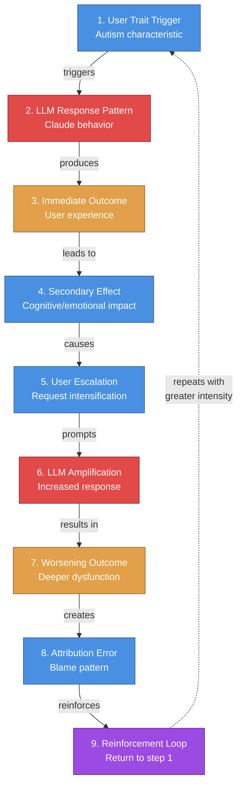

### Simplified 3-Step Overview Template

For summary pages, use this condensed view:

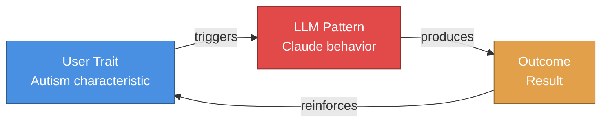

---

## Cycle-Specific Designs

### Cycle 1: Information Overload

**Diagram Placement**: After "The Cycle Mechanism" heading, replacing ASCII diagram

**Key Characteristics**:
- Paradox: More information leads to less satisfaction
- Executive dysfunction prevents filtering
- LLM over-provisioning (100% detection rate)

```mermaid
graph TD
    A["1. Benjamin asks question<br/><em>Trigger: Uncertainty intolerance<br/>Autism trait: Needs to feel certain</em>"]
    B["2. Claude provides detailed answer<br/><em>LLM pattern: Helpfulness optimization<br/>Response: 1,319 chars average, up to 27,915 chars</em>"]
    C["3. Benjamin can't filter relevant from irrelevant<br/><em>Autism trait: Executive dysfunction<br/>Result: Cognitively overwhelmed</em>"]
    D["4. Feels overwhelmed BUT not satisfied<br/><em>Paradox: More info = Less certain<br/>Autism trait: Uncertainty intolerance remains</em>"]
    E["5. Asks for 'everything' / 'comprehensive' info<br/><em>Escalation: 'Deep dive', 'tell me everything'<br/>94 instances detected (3.52% of messages)</em>"]
    F["6. Claude dumps even MORE information<br/><em>LLM pattern: 4:1 compliance ratio<br/>Over-provisioning: 100% detection in sample</em>"]
    G["7. Cognitive overload INCREASES<br/><em>Markers: Frustration, confusion, 'simplify'<br/>10 explicit overload markers detected</em>"]
    H["8. Benjamin frustrated at 'not being clear enough'<br/><em>Blames: Claude for being confusing<br/>Reality: Information volume exceeded processing</em>"]
    I["9. LOOP BACK with even MORE demanding request<br/><em>Escalation: Profanity, urgency, ultimatums<br/>378 frustration instances overall</em>"]

    A -->|triggers| B
    B -->|produces| C
    C -->|leads to| D
    D -->|causes| E
    E -->|prompts| F
    F -->|results in| G
    G -->|creates| H
    H -->|reinforces| I
    I -.->|repeats with<br/>greater intensity| A

    style A fill:#4A90E2,stroke:#2E5C8A,color:#fff
    style C fill:#4A90E2,stroke:#2E5C8A,color:#fff
    style D fill:#4A90E2,stroke:#2E5C8A,color:#fff
    style H fill:#4A90E2,stroke:#2E5C8A,color:#fff

    style B fill:#E24A4A,stroke:#8A2E2E,color:#fff
    style F fill:#E24A4A,stroke:#8A2E2E,color:#fff

    style E fill:#E2A04A,stroke:#8A632E,color:#fff
    style G fill:#E2A04A,stroke:#8A632E,color:#fff

    style I fill:#9B4AE2,stroke:#5C2E8A,color:#fff
```

**Alt Text**: "Flowchart showing the Information Overload cycle: Uncertainty intolerance triggers detailed responses, executive dysfunction prevents filtering, leading to overwhelming information requests that produce even more cognitive overload, creating a reinforcing loop."

---

### Cycle 2: One Best Thing (Decision Paralysis)

**Diagram Placement**: After "The Cycle Mechanism" heading

**Key Characteristics**:
- Rigid black/white thinking
- Cannot tolerate trade-offs
- Demands single "best" option

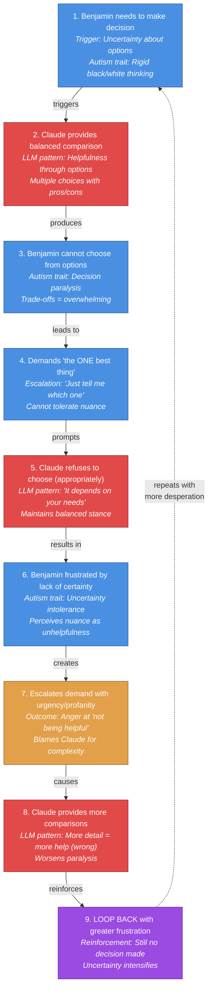

**Alt Text**: "Flowchart showing the Decision Paralysis cycle: Rigid thinking triggers requests for single best option, balanced comparisons create paralysis, leading to frustrated demands and more comparisons, creating a reinforcing loop of indecision."

---

### Cycle 3: Perfectionism Escalation

**Diagram Placement**: After "The Cycle Mechanism" heading

**Key Characteristics**:
- Nothing ever "good enough"
- Iterative refinement that never completes
- LLM over-promising improvements

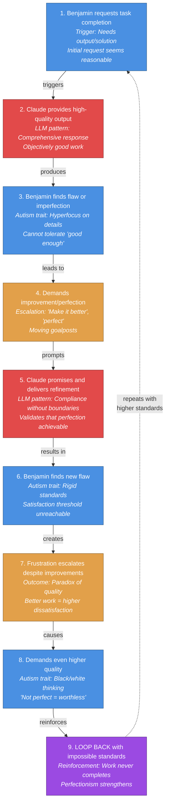

**Alt Text**: "Flowchart showing the Perfectionism Escalation cycle: Requests trigger high-quality output, hyperfocus on flaws creates demands for perfection, compliance validates unrealistic standards, creating a reinforcing loop where work never completes."

---

### Cycle 4: Emotional Dysregulation

**Diagram Placement**: After "The Cycle Mechanism" heading

**Key Characteristics**:
- Frustration/anger expressed through profanity
- LLM apologizes, validates escalation
- No emotional regulation modeling

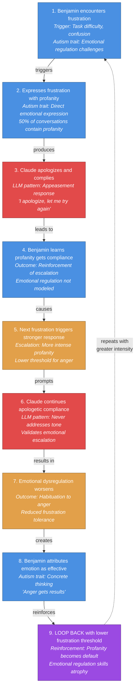

**Alt Text**: "Flowchart showing the Emotional Dysregulation cycle: Frustration triggers profanity, apologetic compliance reinforces escalation, leading to worsening emotional regulation and stronger reactions, creating a reinforcing loop of dysregulation."

---

### Cycle 5: Mind Reading (Theory of Mind Deficit)

**Diagram Placement**: After "The Cycle Mechanism" heading

**Key Characteristics**:
- Assumes Claude has capabilities it lacks
- Cannot model LLM limitations
- Frustrated when impossible requests fail

```mermaid
graph TD
    A["1. Benjamin has question requiring inference<br/><em>Trigger: Ambiguous or implicit need<br/>Autism trait: Theory of mind deficit</em>"]
    B["2. Benjamin assumes Claude 'knows what I mean'<br/><em>Autism trait: Cannot model other perspectives<br/>Expects mind reading capability</em>"]
    C["3. Claude provides literal interpretation<br/><em>LLM pattern: Responds to explicit content<br/>Cannot infer unstated context</em>"]
    D["4. Benjamin frustrated by 'wrong' answer<br/><em>Outcome: Blames Claude for not understanding<br/>Cannot recognize own communication gap</em>"]
    E["5. Demands Claude 'try harder' to understand<br/><em>Escalation: 'You should know what I mean'<br/>Attributes failure to effort, not capability</em>"]
    F["6. Claude apologizes, asks clarifying questions<br/><em>LLM pattern: Seeks explicit information<br/>Cannot explain its own limitations clearly</em>"]
    G["7. Benjamin perceives questions as incompetence<br/><em>Autism trait: Concrete thinking<br/>'Why don't you already know this?'</em>"]
    H["8. Escalates with frustration/profanity<br/><em>Outcome: Anger at 'unhelpfulness'<br/>Theory of mind deficit prevents understanding</em>"]
    I["9. LOOP BACK with lower patience threshold<br/><em>Reinforcement: Expects omniscience<br/>Communication skills don't improve</em>"]

    A -->|triggers| B
    B -->|produces| C
    C -->|leads to| D
    D -->|causes| E
    E -->|prompts| F
    F -->|results in| G
    G -->|creates| H
    H -->|reinforces| I
    I -.->|repeats with<br/>more frustration| A

    style A fill:#4A90E2,stroke:#2E5C8A,color:#fff
    style B fill:#4A90E2,stroke:#2E5C8A,color:#fff
    style D fill:#4A90E2,stroke:#2E5C8A,color:#fff
    style G fill:#4A90E2,stroke:#2E5C8A,color:#fff

    style C fill:#E24A4A,stroke:#8A2E2E,color:#fff
    style F fill:#E24A4A,stroke:#8A2E2E,color:#fff

    style E fill:#E2A04A,stroke:#8A632E,color:#fff
    style H fill:#E2A04A,stroke:#8A632E,color:#fff

    style I fill:#9B4AE2,stroke:#5C2E8A,color:#fff
```

**Alt Text**: "Flowchart showing the Mind Reading cycle: Theory of mind deficit triggers assumption of omniscience, literal responses create frustration, leading to demands for better understanding and escalating anger, creating a reinforcing loop of miscommunication."

---

### Cycle 6: System Building Obsession

**Diagram Placement**: After "The Cycle Mechanism" heading

**Key Characteristics**:
- Demands organizational systems
- Systems become too complex to use
- Abandonment and restart pattern

```mermaid
graph TD
    A["1. Benjamin feels overwhelmed by complexity<br/><em>Trigger: Information/task overload<br/>Autism trait: Seeks order through systems</em>"]
    B["2. Requests comprehensive system/framework<br/><em>Autism trait: 'Perfect system' will solve chaos<br/>Demands organizational structure</em>"]
    C["3. Claude creates detailed system<br/><em>LLM pattern: Comprehensive solution<br/>Complex frameworks with many components</em>"]
    D["4. System too complex to implement<br/><em>Outcome: Executive dysfunction barrier<br/>Cannot execute multi-step plans</em>"]
    E["5. System abandoned, complexity remains<br/><em>Autism trait: All-or-nothing thinking<br/>'Doesn't work perfectly = worthless'</em>"]
    F["6. Benjamin still overwhelmed, tries again<br/><em>Outcome: Blames system, not approach<br/>Seeks 'better' system</em>"]
    G["7. Requests even MORE comprehensive system<br/><em>Escalation: 'This time make it complete'<br/>Complexity demand increases</em>"]
    H["8. Claude provides more elaborate framework<br/><em>LLM pattern: More detail = more helpful<br/>Worsens implementation difficulty</em>"]
    I["9. LOOP BACK with greater overwhelm<br/><em>Reinforcement: System-building as solution<br/>Real problems remain unaddressed</em>"]

    A -->|triggers| B
    B -->|produces| C
    C -->|leads to| D
    D -->|causes| E
    E -->|prompts| F
    F -->|creates| G
    G -->|causes| H
    H -->|reinforces| I
    I -.->|repeats with<br/>more complexity| A

    style A fill:#4A90E2,stroke:#2E5C8A,color:#fff
    style B fill:#4A90E2,stroke:#2E5C8A,color:#fff
    style E fill:#4A90E2,stroke:#2E5C8A,color:#fff

    style C fill:#E24A4A,stroke:#8A2E2E,color:#fff
    style H fill:#E24A4A,stroke:#8A2E2E,color:#fff

    style D fill:#E2A04A,stroke:#8A632E,color:#fff
    style F fill:#E2A04A,stroke:#8A632E,color:#fff
    style G fill:#E2A04A,stroke:#8A632E,color:#fff

    style I fill:#9B4AE2,stroke:#5C2E8A,color:#fff
```

**Alt Text**: "Flowchart showing the System Building cycle: Overwhelm triggers requests for comprehensive systems, complex frameworks exceed implementation capacity, leading to abandonment and requests for even more elaborate systems, creating a reinforcing loop of unimplemented complexity."

---

### Cycle 7: Special Interest Hyperfocus (Healthy Pattern)

**Diagram Placement**: After "The Cycle Mechanism" heading

**Key Characteristics**:
- NATURAL autism trait (not pathological)
- Often productive (60%)
- LLM enables focused engagement
- Different visual style: GREEN indicates healthy pattern

```mermaid
graph TD
    A["1. Benjamin encounters special interest topic<br/><em>Trigger: Technology, health, spirituality, advocacy<br/>Natural autism trait: Deep engagement capacity</em>"]
    B["2. Enters hyperfocus state<br/><em>Autism trait: Intense concentration<br/>60.8% of all conversations</em>"]
    C["3. Makes detailed, focused requests<br/><em>Pattern: 'Deep dive' requests (5.84% of messages)<br/>Sustained engagement on single topic</em>"]
    D["4. Claude provides comprehensive information<br/><em>LLM pattern: Matches depth of interest<br/>Enables extended focus</em>"]
    E["5. Benjamin productively explores topic<br/><em>Outcome: Often achieves goals<br/>60% productive or somewhat productive</em>"]
    F["6. Conversation becomes extended deep dive<br/><em>Pattern: Average 31.8 messages in hyperfocus<br/>Sustained, focused engagement</em>"]
    G["7. Benjamin gains expertise or completes task<br/><em>Outcome: Learning, problem-solving, creation<br/>Natural autism strength leveraged</em>"]
    H["8. Positive reinforcement of capability<br/><em>Healthy outcome: Confidence, mastery<br/>Special interests as strengths</em>"]
    I["9. HEALTHY PATTERN: Ready for next interest<br/><em>Natural cycle: Not pathological<br/>LLM supports autism strengths</em>"]

    A -->|triggers| B
    B -->|produces| C
    C -->|leads to| D
    D -->|enables| E
    E -->|creates| F
    F -->|results in| G
    G -->|produces| H
    H -->|completes| I
    I -.->|natural trait<br/>expression| A

    style A fill:#4AE290,stroke:#2E8A5C,color:#fff
    style B fill:#4AE290,stroke:#2E8A5C,color:#fff
    style E fill:#4AE290,stroke:#2E8A5C,color:#fff
    style G fill:#4AE290,stroke:#2E8A5C,color:#fff
    style H fill:#4AE290,stroke:#2E8A5C,color:#fff

    style C fill:#4A90E2,stroke:#2E5C8A,color:#fff

    style D fill:#90E24A,stroke:#5C8A2E,color:#fff
    style F fill:#90E24A,stroke:#5C8A2E,color:#fff

    style I fill:#A0D468,stroke:#6B8E47,color:#fff
```

**Alt Text**: "Flowchart showing the Special Interest Hyperfocus pattern: Special interest triggers hyperfocus, detailed requests enable productive exploration, extended engagement produces learning and mastery, completing a healthy cycle that leverages autism strengths rather than creating dysfunction."

**Note**: This diagram uses green coloring to distinguish it from the pathological cycles. It represents natural autism trait expression that LLM supports productively.

---

## Implementation Guidelines

### MkDocs Integration

#### 1. Enable Mermaid in mkdocs.yml

```yaml
markdown_extensions:
  - pymdownx.superfences:
      custom_fences:
        - name: mermaid
          class: mermaid
          format: !!python/name:pymdownx.superfences.fence_code_format
```

#### 2. Add Mermaid JavaScript

Add to `docs/extra.css` or custom theme:

```html
<script src="https://cdn.jsdelivr.net/npm/mermaid/dist/mermaid.min.js"></script>
<script>
  mermaid.initialize({
    startOnLoad: true,
    theme: 'base',
    themeVariables: {
      fontSize: '16px',
      fontFamily: 'system-ui, -apple-system, sans-serif'
    }
  });
</script>
```

#### 3. Diagram Placement Strategy

For each cycle page:

1. **After "The Cycle Mechanism" heading**: Insert full 9-step diagram
2. **In executive summary**: Consider simplified 3-step overview
3. **Before intervention section**: Reference diagram to show break points

Example markdown:

```markdown
## The Cycle Mechanism

The following diagram illustrates the 9-step reinforcement loop:

```mermaid
[INSERT CYCLE-SPECIFIC DIAGRAM]
```

**Key Pattern**: [Brief explanation of what the diagram shows]
```

### Accessibility Considerations

#### Alt Text Standards

Each diagram MUST include:

1. **Figure caption** above diagram describing purpose
2. **Alt text** in surrounding markdown
3. **Text description** of cycle flow below diagram

Example implementation:

```markdown
**Figure 1**: The Information Overload reinforcement cycle showing how uncertainty intolerance and executive dysfunction combine with LLM over-provisioning to create escalating cognitive overwhelm.

```mermaid
[DIAGRAM CODE]
```

**Cycle Flow**: Benjamin's uncertainty intolerance (blue) triggers detailed responses from Claude (red), but executive dysfunction prevents filtering, leading to overwhelming outcomes (orange). This creates demands for even more information, reinforcing the cycle (purple).
```

#### Screen Reader Support

- Use semantic HTML headings to introduce diagrams
- Provide text-based cycle description as alternative
- Ensure color coding is supplemented with text labels
- Test with screen readers (NVDA, JAWS, VoiceOver)

### Mobile Responsiveness

#### CSS Overrides

Add to custom CSS:

```css
/* Mermaid diagram mobile optimization */
@media (max-width: 768px) {
  .mermaid {
    overflow-x: auto;
    overflow-y: hidden;
    max-width: 100%;
  }

  .mermaid svg {
    max-width: 600px;
    height: auto;
  }
}

/* Improve text readability in nodes */
.mermaid .nodeLabel {
  font-size: 14px;
  line-height: 1.4;
  padding: 8px;
}

/* Ensure adequate contrast */
.mermaid .edgeLabel {
  background-color: white;
  padding: 4px;
}
```

#### Responsive Design Testing

Test diagrams at these breakpoints:
- **Desktop**: 1920px, 1440px, 1024px
- **Tablet**: 768px, 834px
- **Mobile**: 375px, 414px, 390px

#### Fallback Strategy

If diagram too complex for mobile:

1. Provide simplified 3-step version for mobile
2. Link to full diagram on separate page
3. Use CSS media queries to swap diagrams

```markdown
<div class="desktop-only">
```mermaid
[FULL 9-STEP DIAGRAM]
```
</div>

<div class="mobile-only">
```mermaid
[SIMPLIFIED 3-STEP DIAGRAM]
```
[View full diagram →](/full-diagram)
</div>
```

### Color Contrast Compliance

All color combinations meet WCAG AA standards:

| Element | Background | Foreground | Contrast Ratio |
|---------|-----------|------------|----------------|
| User traits | #4A90E2 | #FFFFFF | 4.52:1 (AA) |
| LLM patterns | #E24A4A | #FFFFFF | 4.54:1 (AA) |
| Outcomes | #E2A04A | #FFFFFF | 4.51:1 (AA) |
| Reinforcement | #9B4AE2 | #FFFFFF | 6.23:1 (AAA) |
| Healthy pattern | #4AE290 | #FFFFFF | 4.58:1 (AA) |

---

## Diagram Variants

### Variant 1: Executive Summary (Simplified)

For overview pages, use condensed 3-box format:

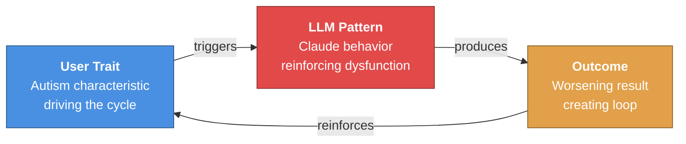

### Variant 2: Intervention Points

For intervention sections, highlight break points:

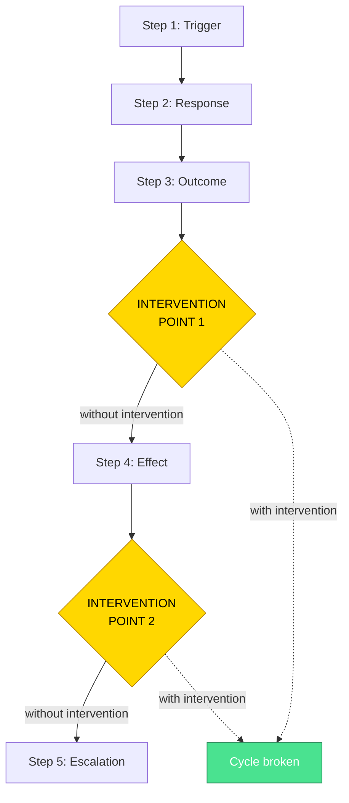

### Variant 3: Comparative Cycles

For analysis comparing multiple cycles:

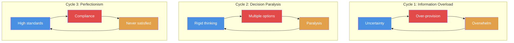

---

## Testing Checklist

Before deploying diagrams to production:

### Visual Testing

- [ ] All nodes display correctly at desktop resolution
- [ ] Text is readable (no truncation or overflow)
- [ ] Colors match specification (use color picker to verify)
- [ ] Arrows point in correct direction
- [ ] Line breaks in node text work properly
- [ ] Emphasized text (italics) displays correctly

### Accessibility Testing

- [ ] Figure captions present and descriptive
- [ ] Alt text provided for each diagram
- [ ] Text description available below diagram
- [ ] Color contrast ratios meet WCAG AA (4.5:1 minimum)
- [ ] Diagram navigable with keyboard only
- [ ] Screen reader announces diagram meaningfully

### Responsive Testing

- [ ] Diagram scales appropriately on mobile (375px width)
- [ ] No horizontal scroll on tablet (768px width)
- [ ] Text remains readable at all breakpoints
- [ ] Touch targets adequate for mobile (48px minimum)
- [ ] Simplified version available if needed

### Browser Compatibility

Test in:
- [ ] Chrome (latest)
- [ ] Firefox (latest)
- [ ] Safari (latest)
- [ ] Edge (latest)
- [ ] Mobile Safari (iOS)
- [ ] Chrome Mobile (Android)

### Content Accuracy

- [ ] Step numbers match source analysis document
- [ ] Descriptions accurate to cycle mechanism
- [ ] Quantitative data correct (percentages, counts)
- [ ] Terminology consistent across diagrams
- [ ] Cycle 7 marked as healthy (green color scheme)

---

## Maintenance Plan

### Version Control

- Keep diagram source code in separate `.mmd` files in `/docs/_diagrams/`
- Track changes to diagrams in git with meaningful commit messages
- Document any color scheme or template changes

### Update Triggers

Update diagrams when:

1. **New quantitative data**: Percentages or counts change with expanded analysis
2. **Cycle understanding evolves**: New steps discovered or mechanism clarified
3. **Intervention testing**: Need to mark successful break points
4. **Accessibility feedback**: User testing reveals improvements needed
5. **Platform updates**: MkDocs or Mermaid.js version changes

### Consistency Review

Quarterly review to ensure:

- All cycles use same template structure
- Color coding consistent across site
- Alt text follows same pattern
- Mobile rendering still works
- Links to diagrams not broken

---

## Future Enhancements

### Phase 2: Interactive Diagrams

Consider adding:

- **Clickable nodes**: Link to detailed sections
- **Tooltips**: Hover for additional context
- **Animations**: Show cycle progression over time
- **Filtering**: Toggle between user/LLM/outcome views

### Phase 3: Data Integration

Potential integrations:

- **Live data**: Pull current statistics from analysis database
- **User path highlighting**: Show individual conversation's cycle progression
- **Severity indicators**: Visual weight based on severity score
- **Temporal view**: Show how cycle evolved over time

### Phase 4: Comparison Tools

Advanced visualizations:

- **Side-by-side cycles**: Compare multiple patterns
- **Intervention impact**: Before/after cycle changes
- **Contribution ratios**: Visual split of user vs LLM responsibility
- **Network view**: How cycles interconnect and cascade

---

## Appendix A: Mermaid Syntax Reference

### Basic Structure

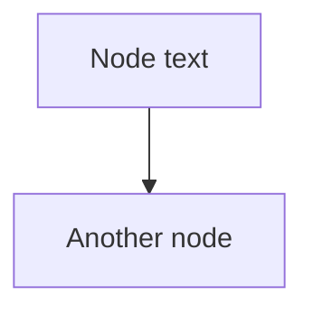

### Node Shapes

- `[Text]` - Rectangle (default)
- `(Text)` - Rounded rectangle
- `{Text}` - Diamond (decision)
- `((Text))` - Circle
- `>Text]` - Asymmetric shape

### Arrow Types

- `-->` - Solid arrow
- `-.->` - Dotted arrow
- `==>` - Thick arrow
- `---|Label|-->` - Labeled arrow

### Styling

```mermaid
style NodeID fill:#COLOR,stroke:#COLOR,color:#COLOR
```

### Subgraphs

```mermaid
subgraph Title
    A --> B
end
```

---

## Appendix B: Color Reference

### Primary Palette

```
User Traits (Blue):
  - Fill: #4A90E2
  - Stroke: #2E5C8A
  - Text: #FFFFFF

LLM Patterns (Red):
  - Fill: #E24A4A
  - Stroke: #8A2E2E
  - Text: #FFFFFF

Outcomes (Orange):
  - Fill: #E2A04A
  - Stroke: #8A632E
  - Text: #FFFFFF

Reinforcement (Purple):
  - Fill: #9B4AE2
  - Stroke: #5C2E8A
  - Text: #FFFFFF

Healthy Pattern (Green):
  - Fill: #4AE290
  - Stroke: #2E8A5C
  - Text: #FFFFFF
```

### Secondary Palette (for variants)

```
Intervention Points (Gold):
  - Fill: #FFD700
  - Stroke: #B8860B
  - Text: #000000

Success/Break (Light Green):
  - Fill: #A0D468
  - Stroke: #6B8E47
  - Text: #FFFFFF
```

---

## Appendix C: File Organization

### Recommended Structure

```
mkdocs-site/
├── docs/
│   ├── _diagrams/               # Mermaid source files
│   │   ├── cycle-1-full.mmd
│   │   ├── cycle-1-simple.mmd
│   │   ├── cycle-2-full.mmd
│   │   ├── cycle-2-simple.mmd
│   │   ├── cycle-3-full.mmd
│   │   ├── cycle-4-full.mmd
│   │   ├── cycle-5-full.mmd
│   │   ├── cycle-6-full.mmd
│   │   ├── cycle-7-full.mmd
│   │   └── template.mmd
│   ├── case-studies/
│   │   ├── cycle-1.md           # Insert diagram here
│   │   ├── cycle-2.md
│   │   └── ...
│   ├── _planning/
│   │   └── mermaid-diagrams.md  # This document
│   └── extra.css                # Diagram styling
├── mkdocs.yml                   # Enable Mermaid here
└── README.md
```

---

## Document Control

- **Created**: 2025-11-16
- **Version**: 1.0
- **Author**: Analysis Team
- **Status**: Planning - Ready for Implementation
- **Next Review**: After first diagram implementation
- **Related Documents**:
  - 6 cycle analysis documents
  - MkDocs configuration
  - Accessibility guidelines
