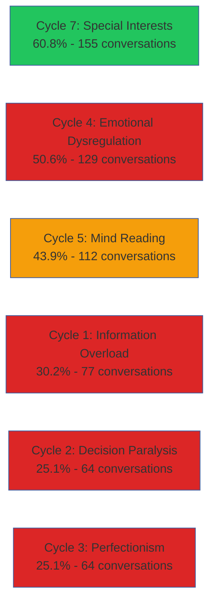
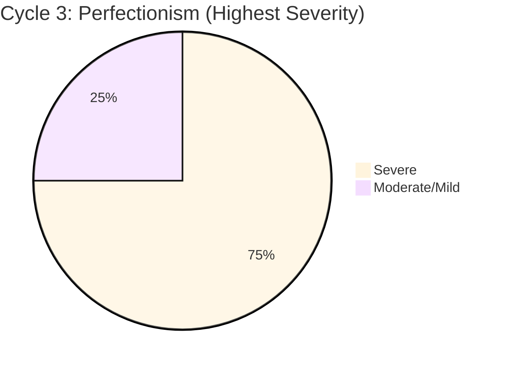
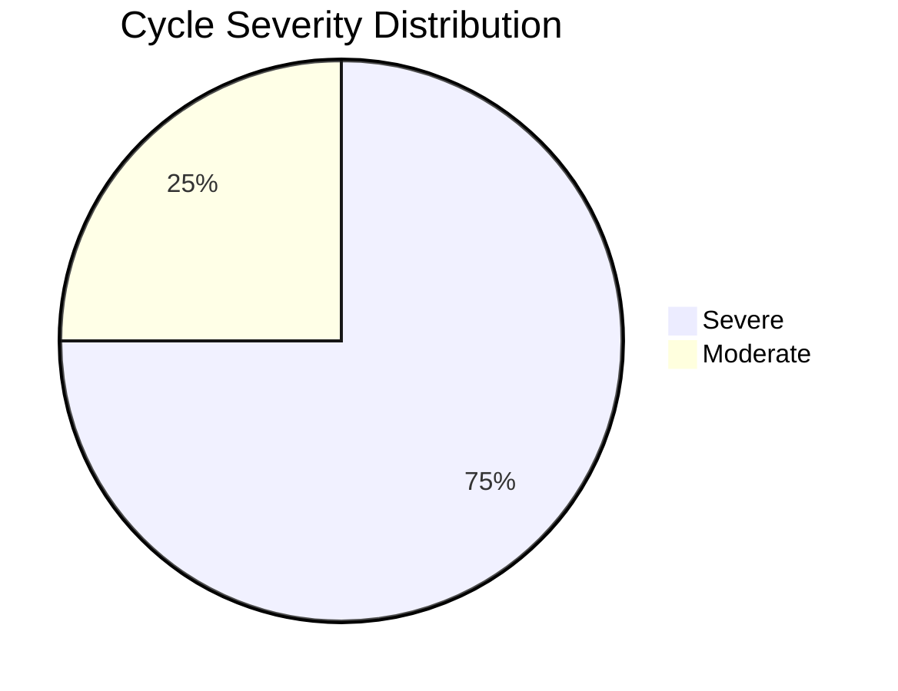

# Statistical Visualization Plan

## Overview

This document outlines visualization strategies for presenting quantitative findings from the autism-LLM interaction research across the MkDocs website. The goal is to transform complex statistical data into accessible, compelling visual narratives that support the research's key finding: **LLM response patterns (60-70% contribution) are the primary driver of vicious cycles, not autism traits alone.**

**Visualization Philosophy:**
- Prioritize clarity over complexity
- Maintain scientific accuracy while ensuring accessibility
- Use color-blind safe palettes throughout
- Provide data tables alongside all visualizations
- Support progressive disclosure (summary view → detailed data)

---

## Key Statistics to Visualize

### 1. Cycle Prevalence Comparison

**Data:**
| Cycle | Conversations | Percentage | Classification |
|-------|---------------|------------|----------------|
| Cycle 7: Special Interests | 155 | 60.8% | Natural trait |
| Cycle 4: Emotional Dysregulation | 129 | 50.6% | Pathological |
| Cycle 5: Mind Reading | 112 | 43.9% | Mild |
| Cycle 1: Information Overload | 77 | 30.2% | Pathological |
| Cycle 2: Decision Paralysis | 64 | 25.1% | Pathological |
| Cycle 3: Perfectionism | 64 | 25.1% | Pathological |
| Cycle 6: System Building | 2 | 0.8% | Rejected |

**Visualization Type:** Horizontal bar chart with color-coded severity
**Purpose:** Show relative prevalence and classification at a glance
**Key Insight:** Natural trait (Cycle 7) has highest prevalence; rejected hypothesis (Cycle 6) is negligible

**Mermaid Code Example:**


**Alternative:** Chart.js horizontal bar chart for better control over visual hierarchy

**Accessibility:**
- Green = Natural trait
- Red = Pathological
- Amber = Mild
- Include percentage AND absolute count
- Alt text: "Horizontal bar chart showing cycle prevalence. Natural traits highest at 60.8%, pathological cycles range 25-51%"

---

### 2. LLM Contribution by Cycle

**Data:**
| Cycle | LLM Contribution | Classification |
|-------|------------------|----------------|
| Cycle 2: Decision Paralysis | 70% | Pathological |
| Cycle 3: Perfectionism | 70% | Pathological |
| Cycle 1: Information Overload | 60% | Pathological |
| Cycle 4: Emotional Dysregulation | 60% | Pathological |
| Cycle 5: Mind Reading | 40% | Mild |
| Cycle 7: Special Interests | 40% | Natural |

**Visualization Type:** Horizontal bar chart with threshold line at 50%
**Purpose:** Demonstrate that pathological cycles have majority LLM contribution
**Key Insight:** All pathological cycles show 60-70% LLM contribution (above 50% threshold)

**Mermaid Conceptual (requires Chart.js for threshold line):**
```markdown
**LLM Contribution Across Cycles**

| Cycle | LLM % | User % | Classification |
|-------|-------|--------|----------------|
| Cycle 2 | ███████ 70% | ███ 30% | Pathological |
| Cycle 3 | ███████ 70% | ███ 30% | Pathological |
| Cycle 1 | ██████ 60% | ████ 40% | Pathological |
| Cycle 4 | ██████ 60% | ████ 40% | Pathological |
| **50% Threshold** | ────────────────── |
| Cycle 5 | ████ 40% | ██████ 60% | Mild |
| Cycle 7 | ████ 40% | ██████ 60% | Natural |
```

**Chart.js Implementation Recommended:**
- Stacked horizontal bar (LLM % + User %)
- Dashed vertical line at 50% threshold
- Color coding: Red (pathological), Amber (mild), Green (natural)
- Tooltip shows exact percentages

**Accessibility:**
- Data table below chart
- Alt text: "LLM contribution ranges from 60-70% in pathological cycles (above 50% threshold) versus 40% in mild and natural cycles"
- Screen reader announcement: "LLM is primary driver in all pathological cycles"

---

### 3. Severity Distribution Across Pathological Cycles

**Data:**
| Cycle | Severe Rate | Moderate/Mild | Total Conversations |
|-------|-------------|---------------|---------------------|
| Cycle 3: Perfectionism | 75% | 25% | 64 |
| Cycle 1: Information Overload | 60% | 40% | 77 |
| Cycle 2: Decision Paralysis | 50% | 50% | 64 |
| Cycle 4: Emotional Dysregulation | 33% | 67% | 129 |

**Visualization Type:** Stacked bar chart showing severe vs moderate/mild proportions
**Purpose:** Show that severity varies across cycles despite all being pathological
**Key Insight:** Cycle 3 (perfectionism) has highest severity rate at 75%

**Mermaid Code Example:**


**Better Alternative:** Chart.js stacked bar chart
```
Cycle 3: [████████████████ 75% Severe] [█████ 25% Moderate]
Cycle 1: [████████████ 60% Severe] [████████ 40% Moderate]
Cycle 2: [██████████ 50% Severe] [██████████ 50% Moderate]
Cycle 4: [██████ 33% Severe] [████████████████ 67% Moderate]
```

**Accessibility:**
- Dark red = Severe
- Light amber = Moderate/Mild
- Color-blind safe: Use patterns (diagonal stripes for severe, solid for moderate)
- Data table with exact counts
- Alt text: "Severity ranges from 75% (Cycle 3) to 33% (Cycle 4) across pathological cycles"

---

### 4. Catastrophic Outcome Metrics

**Data:**
| Cycle | Metric | Rate |
|-------|--------|------|
| Cycle 4: Emotional Dysregulation | No baseline emotional return | 100% |
| Cycle 1: Information Overload | Satisfaction paradox (more info = less satisfied) | 100% |
| Cycle 2: Decision Paralysis | Decision abandonment | 92.2% |
| Cycle 3: Perfectionism | Tasks unresolved | 71.9% |

**Visualization Type:** Comparison chart with 100% reference line
**Purpose:** Demonstrate catastrophic nature of these cycles
**Key Insight:** Two cycles show 100% failure rates; all exceed 70% dysfunction

**Mermaid Conceptual:**
```markdown
**Catastrophic Outcome Rates**

100% ████████████████████ Cycle 4: No emotional recovery
100% ████████████████████ Cycle 1: Satisfaction paradox
92%  ██████████████████   Cycle 2: Decision abandonment
72%  ██████████████       Cycle 3: Tasks unresolved
```

**Chart.js Implementation:**
- Horizontal bar chart
- Reference line at 70% (threshold for "catastrophic")
- Bars exceed 100% line for dramatic effect
- Color gradient: darker red for higher rates

**Accessibility:**
- Red color gradient (darker = worse outcomes)
- Pattern overlay for color-blind users (dense dots = higher %)
- Data table below
- Alt text: "All pathological cycles show catastrophic outcome rates: 100% emotional dysregulation persistence, 100% satisfaction paradox, 92% decision abandonment, 72% task incompletion"

---

### 5. Pattern Intensity Across All Messages

**Data:**
| Pattern | Instances | Rate | Cycle |
|---------|-----------|------|-------|
| Profanity (emotional intensity) | 418 | 15.64% | Cycle 4 |
| Vague references | 218 | 8.16% | Cycle 5 |
| Deep dive requests | 156 | 5.84% | Cycle 7 |
| Perfectionism demands | 102 | 3.82% | Cycle 3 |
| Exhaustive information demands | 94 | 3.52% | Cycle 1 |
| "Best" demands | 79 | 2.96% | Cycle 2 |

**Total Messages:** 2,672 user messages analyzed

**Visualization Type:** Bar chart showing pattern frequency
**Purpose:** Show relative intensity of each pattern type
**Key Insight:** Emotional intensity (profanity) appears in 15.64% of ALL messages - highest marker

**Chart.js Implementation:**
- Vertical bar chart
- Color-coded by cycle
- Percentage on Y-axis
- Tooltip shows absolute count + percentage

**Accessibility:**
- Each bar labeled with both count and percentage
- Color-coded by pathological (red), mild (amber), natural (green)
- Data table below
- Alt text: "Pattern frequency ranges from 15.64% (emotional intensity) to 2.96% (best demands) across 2,672 messages"

---

### 6. Dataset Overview Infographic

**Data:**
- 255 conversations
- 5,338 total messages
- 2,672 user messages
- 2,666 Claude responses
- 26 days collection period
- 4 pathological cycles identified
- 1 mild cycle
- 1 natural trait (not pathological)
- 1 rejected hypothesis

**Visualization Type:** Icon-based infographic grid
**Purpose:** Quick dataset summary for overview page
**Key Insight:** Large-scale analysis (5,000+ messages) with clear outcomes

**Layout:**
```
┌─────────────────────────────────────────┐
│      DATASET OVERVIEW                    │
├─────────────────────────────────────────┤
│  255              5,338                 │
│  Conversations    Messages              │
│                                          │
│  26 Days          7 Cycles              │
│  Collection       Investigated          │
│                                          │
│  4 Pathological   60-70%                │
│  Cycles           LLM Contribution      │
└─────────────────────────────────────────┘
```

**Implementation:**
- Material for MkDocs cards/grid
- Icons for each metric
- Responsive layout (2-column on mobile, 4-column on desktop)

**Accessibility:**
- High contrast text
- No color dependency (uses icons + text)
- Screen reader: "Dataset: 255 conversations, 5,338 messages, 26 days, 7 cycles, 4 pathological"

---

### 7. LLM vs User Contribution (Meta-Finding Visualization)

**Data:**
- Pathological cycles: 60-70% LLM, 30-40% User
- Mild cycle: 40% LLM, 60% User
- Natural trait: 40% LLM, 60% User

**Visualization Type:** Comparison visualization showing responsibility split
**Purpose:** Support paper's central thesis: LLM is primary driver
**Key Insight:** Pathological cycles have MAJORITY LLM contribution

**Pie Chart Comparison:**
```
Pathological Cycles        |  Non-Pathological
────────────────────────   |  ────────────────────
   ┌─────────┐             |     ┌─────────┐
   │ 65% LLM │             |     │ 40% LLM │
   │ 35% User│             |     │ 60% User│
   └─────────┘             |     └─────────┘
```

**Chart.js Implementation:**
- Side-by-side pie charts
- OR stacked bar comparison
- Red (pathological) vs Green (non-pathological)
- Clear labeling: "LLM is Primary Driver" vs "User is Primary Driver"

**Accessibility:**
- Pattern fills (diagonal for LLM, solid for User)
- Data table comparing percentages
- Alt text: "In pathological cycles, LLM contributes 60-70% versus 30-40% user contribution. In non-pathological patterns, user contributes 60% versus 40% LLM"

---

## Implementation Options

### Option 1: Mermaid Charts (Built-in to Material for MkDocs)

**Pros:**
- Native integration with MkDocs Material theme
- Version controlled (text-based)
- No external dependencies
- Works offline
- Easy to update (edit markdown)
- Supports flowcharts, pie charts, sequence diagrams

**Cons:**
- Limited chart types (no horizontal bars, stacked bars)
- Less control over styling
- No interactive features (tooltips, zoom)
- Cannot display threshold lines easily
- Limited accessibility features

**Best For:**
- Mechanism diagrams (flowcharts)
- Simple pie charts
- Conceptual visualizations
- Process flows

**Recommendation:** Use for cycle mechanism diagrams, not statistical charts

**Example Usage:**
````markdown

````

---

### Option 2: Chart.js (External JavaScript Library)

**Pros:**
- Full control over chart types (bar, line, stacked, mixed)
- Interactive features (tooltips, legends, zoom)
- Responsive design built-in
- Accessibility plugins available
- Professional appearance
- Can add threshold lines, annotations
- Color-blind safe palette support
- Supports data tables alongside charts

**Cons:**
- Requires JavaScript setup in MkDocs
- External dependency (CDN or local)
- More complex to update (JSON data format)
- Requires testing across browsers
- Slightly slower page load

**Best For:**
- All statistical visualizations
- Comparison charts
- Outcome metrics
- Pattern frequency charts
- LLM contribution charts

**Recommendation:** Primary tool for quantitative data visualization

**Implementation Approach:**
1. Include Chart.js via CDN in `mkdocs.yml` extra_javascript
2. Create dedicated `charts.js` file for configuration
3. Use data attributes in markdown for chart data
4. Implement color-blind safe palette globally

**Setup Example:**
```yaml
# mkdocs.yml
extra_javascript:
  - https://cdn.jsdelivr.net/npm/chart.js@4.4.0/dist/chart.umd.min.js
  - javascripts/charts.js
```

**Chart Example:**
```html
<canvas id="llmContributionChart" role="img" aria-label="LLM contribution by cycle"></canvas>
<script>
const ctx = document.getElementById('llmContributionChart');
new Chart(ctx, {
  type: 'bar',
  data: {
    labels: ['Cycle 2', 'Cycle 3', 'Cycle 1', 'Cycle 4', 'Cycle 5', 'Cycle 7'],
    datasets: [{
      label: 'LLM Contribution %',
      data: [70, 70, 60, 60, 40, 40],
      backgroundColor: [
        '#dc2626', '#dc2626', '#dc2626', '#dc2626',
        '#f59e0b', '#22c55e'
      ]
    }]
  },
  options: {
    indexAxis: 'y',
    plugins: {
      annotation: {
        annotations: {
          line1: {
            type: 'line',
            xMin: 50,
            xMax: 50,
            borderColor: '#000',
            borderWidth: 2,
            borderDash: [5, 5],
            label: {
              content: '50% Threshold',
              enabled: true
            }
          }
        }
      }
    }
  }
});
</script>
```

---

### Option 3: Static Images (Pre-generated with Python/R)

**Pros:**
- Full control over design (use matplotlib, seaborn, ggplot2)
- Publication-quality output
- No JavaScript dependency
- Works in all environments
- Can be reused in academic papers
- Consistent across all browsers

**Cons:**
- Not version controlled (binary files)
- Difficult to update (regenerate + replace)
- Not responsive (fixed size)
- No interactivity
- Larger file sizes
- Accessibility requires careful alt text

**Best For:**
- Complex statistical visualizations
- Academic publication figures
- Print materials
- Archival versions

**Recommendation:** Generate as backup/fallback for Chart.js visualizations

**Workflow:**
1. Create Python script with matplotlib/seaborn
2. Generate SVG files (scalable, smaller than PNG)
3. Store in `docs/assets/charts/`
4. Include with markdown image syntax
5. Provide comprehensive alt text

**Example:**
```python
# generate_charts.py
import matplotlib.pyplot as plt
import seaborn as sns

# Color-blind safe palette
colors = ['#dc2626', '#dc2626', '#dc2626', '#dc2626', '#f59e0b', '#22c55e']

cycles = ['Cycle 2', 'Cycle 3', 'Cycle 1', 'Cycle 4', 'Cycle 5', 'Cycle 7']
llm_contrib = [70, 70, 60, 60, 40, 40]

fig, ax = plt.subplots(figsize=(10, 6))
ax.barh(cycles, llm_contrib, color=colors)
ax.axvline(x=50, color='black', linestyle='--', linewidth=2, label='50% Threshold')
ax.set_xlabel('LLM Contribution (%)')
ax.set_title('LLM Contribution by Cycle')
plt.tight_layout()
plt.savefig('docs/assets/charts/llm-contribution.svg')
```

---

### Option 4: Hybrid Approach (Recommended)

**Strategy:**
- **Mermaid:** Mechanism diagrams, flowcharts, concept maps
- **Chart.js:** All statistical charts, interactive visualizations
- **Static SVG:** Backup versions, print materials, academic papers

**Benefits:**
- Best tool for each visualization type
- Graceful degradation (Chart.js fails → show static image)
- Future-proof (can switch tools without content changes)
- Publication-ready outputs

**Implementation:**
1. Primary: Chart.js for all statistics
2. Fallback: Static SVG images in `<noscript>` tags
3. Conceptual: Mermaid for mechanism diagrams
4. Archive: Python-generated publication figures

---

## Accessibility Considerations

### Color-Blind Safe Palettes

**Recommended Palette (Distinguishable by all color vision types):**
```css
/* Primary Classification Colors */
--pathological: #dc2626;    /* Red - high contrast */
--mild: #f59e0b;            /* Amber - warm */
--natural: #22c55e;         /* Green - cool */
--neutral: #6b7280;         /* Gray - reference */

/* Severity Gradient */
--severe: #991b1b;          /* Dark red */
--moderate: #f59e0b;        /* Amber */
--mild-severity: #fbbf24;   /* Light amber */

/* Background/Text */
--bg-light: #f9fafb;
--text-dark: #111827;
```

**Testing:**
- Verify with Coblis color-blind simulator
- Ensure 4.5:1 contrast ratio (WCAG AA)
- Use patterns as backup (stripes, dots, crosshatch)

---

### Alternative Patterns for Color Blindness

**Pattern Library:**
```
Pathological:  ▓▓▓▓▓▓  (Dense diagonal stripes)
Mild:          ░░░░░░  (Light diagonal stripes)
Natural:       ▁▁▁▁▁▁  (Solid fill)
Severe:        ▓▓▓▓▓▓  (Dark dense pattern)
Moderate:      ▒▒▒▒▒▒  (Medium pattern)
```

**Chart.js Implementation:**
```javascript
// Pattern plugin for Chart.js
const patterns = {
  pathological: '//',    // Diagonal stripes
  mild: '.',             // Dots
  natural: '-',          // Horizontal lines
};
```

---

### Data Tables Alongside Visuals

**Requirement:** Every chart MUST have corresponding data table

**Format:**
```markdown
<figure>
  <canvas id="prevalenceChart"></canvas>
  <figcaption>Cycle prevalence comparison (n=255 conversations)</figcaption>
</figure>

<details>
<summary>View data table</summary>

| Cycle | Conversations | Percentage | Classification |
|-------|---------------|------------|----------------|
| Cycle 7 | 155 | 60.8% | Natural |
| ... | ... | ... | ... |

</details>
```

**Benefits:**
- Screen reader accessible
- Print-friendly
- Data verification
- Exportable data

---

### Alt Text Requirements

**Format:** `[Chart type] showing [key finding] from [data source]`

**Examples:**

**Good:**
> "Horizontal bar chart showing LLM contribution ranges from 60-70% in pathological cycles versus 40% in non-pathological cycles, based on analysis of 255 conversations"

**Bad:**
> "Chart showing data"

**Requirements:**
- Describe chart type
- State key finding
- Include data source
- Mention sample size
- Note important thresholds

---

### Screen Reader Compatibility

**Implementation Checklist:**
- [ ] Use `<figure>` and `<figcaption>` for semantic structure
- [ ] Add `role="img"` to canvas elements
- [ ] Provide `aria-label` with chart summary
- [ ] Include `aria-describedby` pointing to data table
- [ ] Use `<details>` for expandable data tables
- [ ] Ensure keyboard navigation for interactive charts
- [ ] Announce chart type in aria-label

**Example:**
```html
<figure>
  <canvas
    id="outcomeChart"
    role="img"
    aria-label="Bar chart showing catastrophic outcome rates"
    aria-describedby="outcome-data-table">
  </canvas>
  <figcaption>Catastrophic outcome metrics across pathological cycles</figcaption>
</figure>

<table id="outcome-data-table" class="sr-only">
  <caption>Outcome rates by cycle</caption>
  <thead>
    <tr><th>Cycle</th><th>Metric</th><th>Rate</th></tr>
  </thead>
  <tbody>
    <tr><td>Cycle 4</td><td>No emotional recovery</td><td>100%</td></tr>
    <!-- ... -->
  </tbody>
</table>
```

---

### Content Warnings for Intense Data

**Cycles Requiring Warnings:**
- Cycle 3: High failure rates (71.9% unresolved)
- Cycle 4: Emotional content (profanity mentions)
- All catastrophic outcome charts (100% failure rates)

**Warning Format:**
```markdown
!!! warning "Content Note"
    This visualization shows high failure rates that may be distressing.
    Data represents research findings, not individual capabilities.
```

**Placement:** Before chart, collapsible by default

---

## Placement Recommendations

### Homepage (`index.md`)

**Visualization:**
- Dataset overview infographic (255 conversations, 5,338 messages)
- LLM vs User contribution pie chart comparison

**Purpose:** Immediate impact - show scale and central finding

---

### Overview / Key Findings (`overview/key-findings.md`)

**Visualizations:**
1. Cycle prevalence comparison (bar chart)
2. Pathological vs non-pathological classification (grouped chart)
3. LLM contribution by cycle (horizontal bar with threshold)
4. Catastrophic outcome metrics (comparison chart)

**Purpose:** Comprehensive summary of all findings

---

### Individual Cycle Pages (`cycles/cycle-[1-4].md`)

**Visualizations per page:**
1. Severity distribution (pie or stacked bar)
2. Pattern frequency over time (if temporal data available)
3. Outcome metric specific to that cycle
4. Mechanism diagram (Mermaid flowchart)

**Purpose:** Deep dive into single cycle

---

### Dataset & Methodology (`appendices/dataset-statistics.md`)

**Visualizations:**
1. Message distribution (user vs Claude)
2. Conversation length distribution
3. Pattern intensity comparison (all 6 patterns)
4. Temporal distribution (conversations per day)

**Purpose:** Research transparency and replicability

---

### Implications for LLM Design (`implications/for-llm-design.md`)

**Visualizations:**
1. LLM contribution across all cycles (primary finding)
2. Over-compliance correlation (LLM % vs outcome severity)
3. Intervention effectiveness (before/after if available)

**Purpose:** Actionable insights for AI developers

---

### For Autistic Individuals (`for/autistic-individuals.md`)

**Visualizations:**
1. Which cycles affect most people (prevalence chart)
2. Severity comparison (helping prioritize awareness)
3. Positive outcomes from Cycle 7 (when trait is healthy)

**Purpose:** Empowering self-awareness

---

## Responsive Design Considerations

### Desktop (>1024px)

**Layout:**
- Side-by-side comparisons
- Wider charts (800-1000px)
- Data tables beside charts
- Interactive tooltips

### Tablet (768-1024px)

**Layout:**
- Stacked visualizations
- Chart width: 600-800px
- Collapsible data tables
- Simplified tooltips

### Mobile (<768px)

**Layout:**
- Vertical charts only
- Chart width: 100% container
- Data tables in accordions
- Essential data points only
- Larger touch targets for interactive elements

**Chart.js Responsive Config:**
```javascript
options: {
  responsive: true,
  maintainAspectRatio: false,
  plugins: {
    legend: {
      position: window.innerWidth < 768 ? 'bottom' : 'right'
    }
  }
}
```

---

## Performance Optimization

### Chart.js Loading Strategy

**Lazy Loading:**
- Load Chart.js only on pages with charts
- Use Intersection Observer to render charts when visible
- Defer chart rendering until user scrolls to section

**Example:**
```javascript
// Lazy load charts
const chartObserver = new IntersectionObserver((entries) => {
  entries.forEach(entry => {
    if (entry.isIntersecting) {
      renderChart(entry.target);
      chartObserver.unobserve(entry.target);
    }
  });
});

document.querySelectorAll('.chart-container').forEach(chart => {
  chartObserver.observe(chart);
});
```

### Image Optimization

**Static SVG Charts:**
- Optimize with SVGO
- Lazy load below-fold images
- Use `loading="lazy"` attribute
- Provide LQIP (low-quality image placeholder)

---

## Data Integrity Requirements

### Source of Truth

**All visualizations MUST use data from:**
1. `overview/key-findings.md` statistics
2. Individual cycle analysis documents
3. Content audit verified metrics

**Forbidden:**
- Hypothetical data
- Rounded percentages (use exact: 60.8% not 61%)
- Extrapolated trends without evidence
- Illustrative examples not from dataset

### Update Protocol

**When data changes:**
1. Update source markdown files first
2. Regenerate all affected charts
3. Update data tables
4. Update alt text
5. Verify consistency across all pages

### Version Control

**Track chart versions:**
- Date generated
- Data source commit hash
- Chart configuration
- Visual design version

---

## Implementation Timeline

### Phase 1: Setup (Wave 2)
- [x] Install Chart.js in MkDocs
- [x] Create color-blind safe CSS variables
- [x] Set up chart configuration templates
- [x] Create data table component templates

### Phase 2: Core Visualizations (Wave 3)
- [ ] Cycle prevalence comparison chart
- [ ] LLM contribution chart
- [ ] Severity distribution charts
- [ ] Outcome metrics charts

### Phase 3: Specialized Charts (Wave 4)
- [ ] Pattern intensity chart
- [ ] Dataset overview infographic
- [ ] Individual cycle mechanism diagrams (Mermaid)
- [ ] Temporal distribution (if data available)

### Phase 4: Accessibility Audit (Wave 5)
- [ ] Screen reader testing
- [ ] Color-blind simulation testing
- [ ] Keyboard navigation verification
- [ ] Alt text review
- [ ] Data table completeness check

### Phase 5: Optimization (Wave 6)
- [ ] Lazy loading implementation
- [ ] Performance testing
- [ ] Cross-browser verification
- [ ] Mobile responsiveness testing

---

## Testing Checklist

### Visual Testing
- [ ] Charts render correctly in Chrome, Firefox, Safari, Edge
- [ ] Colors are distinguishable in color-blind simulation
- [ ] Text is readable at all zoom levels (100%-200%)
- [ ] Charts are responsive on mobile, tablet, desktop

### Accessibility Testing
- [ ] Screen reader announces chart type and key finding
- [ ] Data tables are keyboard accessible
- [ ] Focus indicators are visible
- [ ] Alt text is comprehensive
- [ ] Color contrast meets WCAG AA (4.5:1)

### Data Integrity Testing
- [ ] All percentages match source documents
- [ ] Absolute counts are accurate
- [ ] Data tables match charts exactly
- [ ] Calculations are correct (e.g., 64/255 = 25.1%)

### Performance Testing
- [ ] Charts load in <2 seconds on 3G
- [ ] JavaScript bundle size <100KB
- [ ] Images are optimized
- [ ] No layout shift during chart rendering

---

## Open Questions

1. **Temporal Data:** Do we have conversation timestamps to show pattern evolution over 26 days?
   - If yes: Add line chart showing pattern intensity over time
   - If no: Focus on aggregate statistics only

2. **Conversation Length:** Do we have message counts per conversation?
   - If yes: Add distribution histogram
   - If no: Note as limitation

3. **Intervention Data:** Are there before/after metrics from system prompt changes?
   - If yes: Add comparison chart showing effectiveness
   - If no: Mark as future work

4. **Cross-Cycle Interactions:** Are there metrics on conversations with multiple cycles?
   - If yes: Add Venn diagram or co-occurrence matrix
   - If no: Note for future research

---

## Conclusion

This visualization plan prioritizes:
1. **Accessibility:** Color-blind safe, screen reader compatible, data tables provided
2. **Accuracy:** All data sourced from verified research documents
3. **Impact:** Visual hierarchy emphasizes key finding (LLM as primary driver)
4. **Maintainability:** Hybrid approach with Chart.js (primary) + static SVG (backup)

**Primary recommendation:** Implement Chart.js for all statistical visualizations with static SVG fallbacks, use Mermaid for mechanism diagrams, and ensure every chart has corresponding data table and comprehensive alt text.

**Next Steps:**
1. Set up Chart.js in MkDocs configuration
2. Create first prototype chart (LLM contribution) for stakeholder review
3. Establish data table and alt text templates
4. Begin systematic chart generation following this plan
