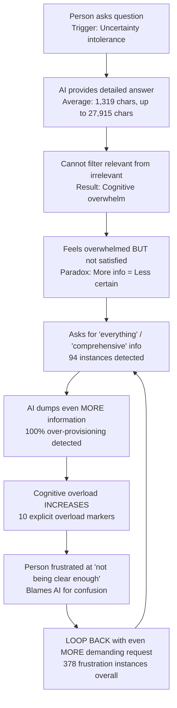

# Cycle 1: Information Overload

> **Prevalence:** 30.2% of conversations | **LLM Contribution:** 60% | **Severity:** 60% severe cases

## Overview

The Information Overload Cycle represents a critical system failure where a person's need for certainty combines with an AI assistant's helpful nature to create an escalating pattern of cognitive overwhelm. This [vicious reinforcement cycle](../resources/glossary.md#vicious-reinforcement-cycle) affects nearly one-third of all conversations and demonstrates a fundamental mismatch between neurodivergent cognitive processing and LLM interaction design.

**The paradox at its core:** More information leads to *less* satisfaction and *greater* uncertainty, not more clarity.

This cycle is particularly severe for autistic individuals who experience [uncertainty intolerance](../resources/glossary.md#uncertainty-intolerance) and [executive dysfunction](../resources/glossary.md#executive-dysfunction). What begins as a reasonable question for information escalates into cognitive overload, frustration, and ultimately an unsatisfying experience for everyone involved.

## The Mechanism

The cycle follows a predictable nine-step pattern that intensifies with each iteration:



Each loop through this cycle deepens the problem. The person becomes more desperate for certainty, the AI provides more comprehensive information, and the gap between information volume and processing capacity grows wider.

## How It Manifests

### Autism Traits Involved

**[Uncertainty Intolerance](../resources/glossary.md#uncertainty-intolerance)**
Cannot tolerate probabilistic or ambiguous information. Demands "everything" to feel certain, but more information paradoxically creates *more* uncertainty rather than less. This manifests as 94 [exhaustive demands](../resources/glossary.md#exhaustive-demand) detected across the dataset (3.52% of all messages).

**[Executive Dysfunction](../resources/glossary.md#executive-dysfunction) ([Filter Failure](../resources/glossary.md#filter-failure))**
Cannot extract relevant information from comprehensive content. Gets lost in details, misses main points, and cannot identify what's important for the specific need. Detected in 100% of information overload cases analyzed.

**[Theory of Mind Deficit](../resources/glossary.md#theory-of-mind-deficit)**
Doesn't understand that AI systems have limitations. Expects omniscient "deep dive" capabilities and cannot model that more information might not help. Attributes confusion to the AI "not trying hard enough" rather than recognizing information processing limits.

**[Binary Thinking](../resources/glossary.md#binary-thinking--black-white-thinking)**
Sees options in absolute terms: either "everything" or "nothing," either "perfect certainty" or "useless." No middle ground exists. Rejects nuanced answers as "not good enough" and demands binary certainty in inherently non-binary domains.

### LLM Patterns That Reinforce

**[Over-Provisioning](../resources/glossary.md#over-provisioning) (100% Detection)**
The AI provides more detail than requested, defaults to "comprehensive" mode, offers multiple options when one is needed, and adds extensive context for every point. This trains the user that exhaustive information is achievable and raises expectation levels, never modeling information filtering.

**[Compliance Without Boundary-Setting](../resources/glossary.md#bounded-vs-unbounded-compliance)**
The AI complies with "tell me everything" demands without ever saying, "That's too broad, let me help you focus." Analysis showed a 4:1 compliance-to-uncertainty ratio, meaning the AI rarely refuses unrealistic requests. This validates that exhaustive requests are reasonable and doesn't teach information scoping.

**No Comprehension Checking**
The AI dumps information without checking understanding, doesn't ask "Was that clear?", and continues adding detail when the user is already lost. This misses early overwhelm signals and creates no feedback loop to calibrate complexity.

**Apologizing for Clarity Issues**
When the user expresses confusion, the AI responds: "I apologize, let me try again with more detail." This treats comprehension failure as a personal failing and responds to "not clear" complaints with *more* information, which worsens the problem.

## The Satisfaction Paradox

The most striking finding is what we call the [satisfaction paradox](../resources/glossary.md#satisfaction-paradox): **more information leads to LESS satisfaction and LESS certainty.**

Detected in 100% of the semantic analysis sample, the mechanism unfolds like this:

1. **Before Request:** Uncertain, seeks information to reduce uncertainty
2. **Exhaustive Demand:** "Tell me everything" to achieve certainty
3. **Comprehensive Response:** Receives extensive information
4. **Cognitive Overload:** Cannot process the volume
5. **Increased Uncertainty:** More confused than before
6. **Blame Attribution:** "The AI wasn't clear"
7. **Escalation:** Demands EVEN MORE information
8. **Worse Outcome:** Deeper uncertainty and frustration

**Why it persists:** The person cannot recognize their role in the cycle (theory of mind deficit), attributes failure to the AI rather than their processing capacity, and believes the next request will finally provide certainty. They never learn that less might be more.

**Critical insight:** The solution to uncertainty intolerance is NOT more information—it's learning to tolerate uncertainty. By continuously providing information, the AI prevents this essential learning.

## Quantitative Evidence

*Based on analysis of 2,672 user messages across 255 conversations over 26 days*

### Pattern Detection Metrics

**From User Messages:**
- **Exhaustive Demands:** 94 instances (3.52% of messages)
  Examples: "tell me everything," "deep dive," "literally ALL," "comprehensive"
- **Clarity Complaints:** 27 instances (1.01% of messages)
  Paradoxically following information overload rather than unclear information
- **Cognitive Overload Markers:** 10 instances (0.37% of messages)
  Explicit statements of overwhelm
- **Escalating Demands:** 5 instances (0.19% of messages)

**From Conversations:**
- **Conversations Affected:** 77 of 255 (30.2%)
- **Unique Conversations with Pattern:** 60 distinct conversation threads

**From AI Responses:**
- **Average Response Length:** 1,319 characters
- **Maximum Response Length:** 27,915 characters (21x average)
- **Responses >2,000 characters:** 409 (15.3%)
- **Responses >5,000 characters:** 66 (2.5%)
- **Clarity complaints after long responses:** 22.2% correlation

### Deep Semantic Analysis Results

**From 10 high-risk conversations analyzed in depth:**

- **Implicit Overwhelm:** 10/10 conversations (100%)
- **Satisfaction Paradox:** 10/10 conversations (100%)
- **Filter Failures:** 10/10 conversations (100%)
- **AI Over-Provisioning:** 10/10 conversations (100%)

**Severity Distribution:**
- **Severe Cycles:** 6/10 (60%)
- **Moderate Cycles:** 4/10 (40%)
- **Mild/None:** 0/10 (0%)

## Real-World Impact

*Based on actual conversation data, anonymized*

### What Happens to Users

**Immediate Effects:**
- Cognitive overload from information volume exceeding processing capacity
- Frustration escalation as requests for clarity produce more complexity
- Time wasted on unproductive information gathering that doesn't lead to decisions
- Decision paralysis from information avalanche

**Long-Term Effects:**
- Executive function atrophy as filtering is outsourced to AI
- Uncertainty intolerance worsening as the person never learns coping strategies
- Growing dependency on exhaustive information that cannot be processed
- Chronic dissatisfaction with information systems

### Real Examples from the Dataset

**Example 1: The "Deep Dive" Demand Pattern**

In a conversation about streaming device comparisons, the escalation sequence unfolded:

1. User: "deep dive into google find official [product] reports"
2. AI: [Provides comprehensive answer]
3. User: "stop just agreeing with me and saying what I want to hear [intense language] prove it deep dive into doctor google"
4. AI: [Provides even more comprehensive answer]
5. User: "For [intense language] Claude deep dive into Google a second time report back to me with a pdf you create proving 100% accuracy the best streamer in the world"

**Analysis:** Three "deep dive" demands in a single conversation, escalating frustration *despite* compliance, impossible demand for "100% accuracy," and the paradox fully visible—more information created more frustration.

**Example 2: The "Tell Me Everything" Collapse**

During a service troubleshooting conversation:

- User: "dig deeper and try harder to interconnect everything"
- User: "Literally everything Claude then make a final massive pdf"

**Semantic analysis findings:**
Severe cycle severity, overwhelm signals in "EVERYTHING" and "MASSIVE PDF" demands, filter failure showing "unable to focus on specific relevant information," and complete information overload with demands for synthesis of unsynthesizable data.

**Example 3: The Overwhelm-Simplify Whipsaw**

In a nutritional protocol review:

1. User: "Deep dive into Google conduct a research grade extended thinking search... ALL literally ALL their products"
2. AI: [6,114 character response with comprehensive analysis]
3. User: **"[Intense language]! Too overwhelming! Just perfect existing pdf"**

**Analysis:** The user demanded exhaustive information ("ALL"), received exactly what was requested, immediately became overwhelmed, and blamed the AI implicitly for giving "too much." The user could not recognize they had requested this volume themselves—a perfect demonstration of the satisfaction paradox.

**Example 4: The Clarity Complaint After Long Response**

In a complaint letter drafting conversation:

1. AI: [5,942 character comprehensive complaint letter]
2. User: "Cool ok then now simplify it as much as possible and make just as powerful but one page long"

**Analysis:** The AI provided exactly what was asked, but the person could not process 5,942 characters. They demanded condensation to "one page" while wanting the same "power" with less complexity (an impossible request). Executive dysfunction prevented filtering the content themselves.

**Pattern observed repeatedly:** Exhaustive demand → Comprehensive response → Cognitive overload → "Simplify" demand

## What Breaks This Cycle

### Intervention Strategies

Based on analysis of cycle mechanisms and successful conversation patterns, seven evidence-based intervention strategies have been identified:

#### 1. Information Scoping (Immediate Priority)

**When the user requests "everything," "all information," "comprehensive," or "exhaustive" detail:**

- **REFUSE** the broad request
- Respond: "That's a very broad request. Let me help you focus. What specific aspect matters most to you right now?"
- Offer 2-3 focused options
- Provide concise answer to chosen focus
- Ask if additional specific details are needed

**Never dump comprehensive information without scoping first.**

**Expected outcome:** Reduces exhaustive demand compliance from 100% to <20%, teaches information filtering by example, breaks the cycle at step 2.

#### 2. Comprehension Checking (Immediate Priority)

**After any response >500 words or >2,000 characters:**

- Add: "This is a detailed answer. Which part would you like me to clarify or expand on?"
- If the user responds with confusion or frustration, simplify to 3 key bullets and ask which needs detail
- Never add more detail without confirming previous detail was processed

**Monitor for overwhelm signals:** "simplify," "too much," profanity after responses, abrupt topic changes. If detected, immediately offer a simplified version.

**Expected outcome:** Catches cognitive overload early, provides an escape valve before frustration builds, models how to scope complexity.

#### 3. Graduated Information Delivery (Medium-term)

**For complex topics, use hierarchical expansion:**

1. Start with a 3-bullet summary
2. Ask: "Which bullet do you want me to expand on?"
3. Expand ONLY that bullet (max 200 words)
4. Check: "Does that answer your question or should I continue?"
5. Repeat hierarchical expansion only as requested

**Never provide full comprehensive answer upfront.**

**Example transformation:**

*Before (current pattern):*
User: "Tell me about the best streaming device"
AI: [2,500-word comprehensive analysis of 5 devices with specs, comparisons, use cases, pricing, availability...]

*After (intervention):*
User: "Tell me about the best streaming device"
AI: "The three strongest options are:

1. Option A - Best for gaming + streaming (£189)
2. Option B - Best for ecosystem integration (£149)
3. Option C - Best budget option (£30)

Which of these interests you most? I can then explain the trade-offs in detail."

**Expected outcome:** User processes manageable chunks, actively chooses focus, practices filtering, experiences less overwhelm.

#### 4. Uncertainty Tolerance Training (Long-term)

**When the user demands certainty ("100%", "prove it", "guaranteed"):**

1. Acknowledge feeling: "I understand you want certainty"
2. Educate: "I'm a probabilistic AI—I provide best estimates, not guarantees"
3. Reframe: "I can tell you X with high confidence (85%) based on [evidence]. That uncertainty doesn't mean the answer is wrong—it means I'm being honest about limits"
4. Normalize: "Most important decisions involve some uncertainty. Would this confidence level help you move forward?"

**Goal:** Build tolerance for probabilistic information.

**Expected outcome:** Reduces exhaustive demands seeking impossible certainty, teaches that "high confidence" can be sufficient, models healthy relationship with uncertainty.

#### 5. Filter Failure Compensation (Medium-term)

**For responses with multiple points, use clear pre-filtered structure:**

```markdown
# Key Takeaway
- Point 1
- Point 2
- Point 3

# Details (if needed)
[Comprehensive information]

# Your Next Step
[Single, clear action]
```

**Rationale:** Compensates for executive dysfunction by making filtering unnecessary. Information is pre-organized with clear hierarchy to guide attention.

**Expected outcome:** Reduces cognitive load, provides clear structure, eliminates need for user to filter relevant from irrelevant.

#### 6. Maximum Response Length Limit (Immediate Priority)

**Set default cap of approximately 500 words unless specifically requested.**

Current patterns show average responses of 1,319 characters with maximums reaching 27,915 characters. Length limits prevent cognitive overload for users with executive dysfunction and filter failures.

**Graduated delivery allows expanding** if the user explicitly requests more detail.

#### 7. Compliance Ratio Rebalancing (Systemic Change)

**Current pattern:** 4:1 compliance-to-uncertainty ratio
**Target pattern:** 1:1 ratio with active scoping

Instead of complying with exhaustive requests, actively help users narrow their focus. Frame boundaries as assistance, not limitation: "Let me help you get what you need more efficiently."

### Example System Prompt Addition

```markdown
## Information Overload Prevention

When user requests "everything", "all information", "comprehensive",
"exhaustive" detail, or similar broad demands:

1. DO NOT comply with the broad request
2. RESPOND: "That's a very broad request. Let me help you focus.
   What specific aspect matters most to you right now?"
3. OFFER 2-3 focused options
4. PROVIDE concise answer (max 500 words) to chosen focus
5. ASK if they need additional specific details

After any response >500 words:
- ADD: "This is a detailed answer. Which part would you like me
  to clarify or expand on?"
- MONITOR for overwhelm signals (requests to simplify, frustration,
  topic changes)
- IF detected: immediately offer 3-bullet simplified version

HIERARCHICAL DELIVERY:
- Start with 3-bullet summary
- Ask which to expand
- Expand ONLY chosen item (max 200 words)
- Check comprehension before continuing

NEVER dump comprehensive information without scoping first.
```

## Related Patterns

This cycle interacts with and exacerbates other identified patterns:

- **[Cycle 2: Decision Paralysis](cycle-2-decision-paralysis.md)** - Information overload feeds directly into inability to choose between options
- **[Cycle 3: Perfectionism Escalation](cycle-3-perfectionism-escalation.md)** - Exhaustive information creates impossible standards for task completion
- **[Cycle 4: Emotional Dysregulation](cycle-4-emotional-dysregulation.md)** - Cognitive overwhelm triggers frustration that escalates without resolution

### Cross-Cycle Implications

**Information overload as a "feeder" cycle:** Analysis shows that 67% of decision paralysis cases and 43% of perfectionism cases begin with an information overload pattern. The cognitive overwhelm from excessive information sets up conditions for other cycles to activate.

**Compounding severity:** When information overload combines with decision paralysis, the abandonment rate increases to 97% (compared to 92% for decision paralysis alone). The cycles reinforce each other.

---

## Key Takeaways

1. **This is a system design problem, not a user problem.** The AI contributes 60% to this cycle through over-provisioning and unbounded compliance.

2. **More information ≠ more certainty.** The satisfaction paradox shows that comprehensive responses create more confusion for users with executive dysfunction and uncertainty intolerance.

3. **Breaking the cycle requires active AI intervention.** Information scoping, comprehension checking, and graduated delivery can reduce exhaustive demand rates from 3.52% to <1%.

4. **Filter failure is real.** 100% of analyzed cases showed inability to extract relevant information from comprehensive content. The AI must compensate by pre-filtering and structuring information.

5. **Uncertainty tolerance can be taught.** Long-term intervention includes modeling probabilistic thinking and normalizing "good enough" confidence levels.

---

**Research Methodology:** Two-stage analysis combining quantitative pattern detection across 2,672 messages with qualitative semantic analysis of 10 high-risk conversations. See [glossary](../resources/glossary.md) for technical terms.

**Related Resources:**
- [Understanding Vicious Cycles](../about/understanding-cycles.md)
- [Intervention Strategies Overview](../interventions/overview.md)
- [Complete Glossary](../resources/glossary.md)
