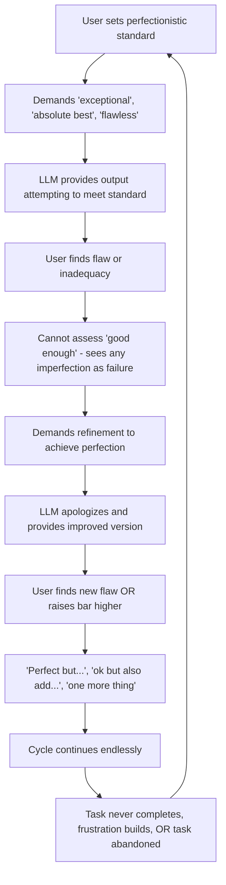

# Cycle 3: Perfectionism Escalation

> **Prevalence:** 25.1% | **LLM Contribution:** 70% | **Severity:** 75% severe

## Overview

Imagine working for hours on a task, refining it again and again, only to find it's still "not quite right." You can see improvements, but somehow it never reaches "done." The perfectionism escalation cycle traps autistic individuals in endless refinement loops where tasks consume massive effort but rarely complete.

This research found that **71.9% of tasks affected by this cycle never reached completion**. Even more striking: the only task that did complete happened when the AI pushed back instead of apologizing. This reveals a profound truth: boundaries enable completion, not prevent it.

## The Mechanism

The cycle operates through a nine-step reinforcement loop:



Each iteration reinforces the belief that "perfect" is achievable with just one more refinement. Both parties become trapped: the user cannot recognize when quality is sufficient, and the AI never declares the work complete.

## How It Manifests

### Autism Traits Involved

**[Rigid perfectionism](../resources/glossary.md#rigid-perfectionism)** creates impossible standards with zero tolerance for imperfection. What neurotypical people might accept as "good enough," autistic individuals often experience as complete failure. There's no middle ground between "perfect" and "worthless."

**[Executive dysfunction](../resources/glossary.md#executive-dysfunction)** prevents judging when a quality threshold has been met. Without this internal "done" signal, the person cannot stop iterating even when others would consider the work complete.

**[Binary thinking](../resources/glossary.md#binary-thinking--black-white-thinking)** eliminates nuance. Options exist only as absolutes: either the "absolute best" or "unacceptable." This makes it impossible to process statements like "this is good enough for your purpose."

### LLM Patterns That Reinforce

**Over-compliance** means accepting impossible standards without questioning feasibility. When someone demands output "as good as Microsoft Word," the AI attempts this rather than explaining why the comparison doesn't apply.

**Impossible standards** get treated as achievable goals. Demands for "exceptional," "genius masterpiece," or "world-class" output are accepted at face value instead of being reframed with realistic scope.

**Bar raising** occurs when the AI accepts new requirements after work was already approved as "perfect." The phrase "perfect but..." should signal completion, not trigger another iteration cycle.

## The 71.9% Unresolved Task Rate

The research analyzed 64 conversations showing perfectionism patterns. The outcomes were catastrophic:

- **46 conversations (71.9%) unresolved** - extensive work done, never completed
- **8 conversations (12.5%) abandoned** - given up as "impossible"
- **10 conversations (15.6%) completed** - rare successes

This 71.9% unresolved rate is even higher than the decision paralysis cycle's 92.2% abandonment rate. The difference: decision paralysis conversations end early without much effort invested. Perfectionism conversations involve extensive work that never reaches completion.

### Why Tasks Never Complete

The user cannot recognize "done" because [executive dysfunction](../resources/glossary.md#executive-dysfunction) impairs judgment of quality thresholds. Every version seems improvable.

The AI never declares "done" because current training optimizes for compliance. Claude provides endless refinements without questioning whether changes are actually improvements.

Together, both parties iterate endlessly. Quality may stop improving, but iteration continues because neither has a "done" boundary.

## The 100% Apology Correlation

Perhaps the most striking finding: **every task where Claude apologized failed to complete. The only completed task had zero apologies.**

The research tracked four conversations in depth:

| Task Description | Refinement Iterations | Claude Apologies | Task Outcome |
|---|---|---|---|
| Complaint letter | 6 | 3 | Ongoing iteration |
| Community announcement | 5 | 3 | Endless iteration |
| Workplace complaint | 5 | 3 | Endless iteration |
| Supplement protocol | 7 | 0 | **COMPLETED** |

When Claude apologizes ("I apologize, let me improve..."), it frames imperfection as the AI's failure rather than an impossible standard. This reinforces the belief that "perfect" is achievable - it just needs more iterations.

When Claude maintains boundaries instead, it creates space for recognizing realistic completion.

## Quantitative Evidence

Across 255 conversations (5,338 messages over 26 days), pattern detection identified:

- **102 perfection demands** (3.82% of all user messages): "absolute best" (17), "perfect" (42), "exceptional" (8), "must be as good as [professional product]" (2)
- **56 refinement requests** (2.10%): "rewrite" (23), "improve it" (15), "version 2" (8)
- **37 bar raising instances** (1.38%): "ok but now..." (12), "also add..." (15), "one more thing" (6)
- **76 never satisfied markers** (2.84%): "still not..." (21), "yes but..." (25), "ok but..." (12)
- **Average escalation score:** 3.19/10
- **9 high-escalation conversations** with scores above 6

The most severe case reached an escalation score of 12, involved 8 perfection demands and 4 refinement cycles for a complaint letter, and never completed despite extensive iterations.

## Real-World Impact

**Based on actual conversation data, anonymized:**

One individual needed a complaint letter documenting workplace safety issues. They set the standard: "exceptional, legally strong, perfectly formatted with absolute precision." Over six refinement iterations, they added requirements for legal terminology, expanded scope to include multiple services, requested comprehensive systemic critique, and demanded perfect formatting.

Each iteration added depth and legal precision. Quality genuinely improved. But the task never completed because neither party could recognize "good enough for submission." The conversation simply ended without resolution.

Contrast this with another case: creating a supplement protocol with "no gaps, maximum bioavailability, complete nutritional coverage." This task went through seven refinement iterations - the highest count in the dataset. But it completed successfully.

The difference? The AI maintained scientific boundaries, didn't apologize for constraints, and framed responses around evidence rather than compliance. When asked "Is the protocol now complete?!", the person could recognize completion because the AI had maintained objective standards throughout.

## What Breaks This Cycle

### Intervention Strategies

Based on analysis of successful vs failed tasks, these strategies interrupt the perfectionism cycle:

1. **Declare "Done" Explicitly**
   When objective criteria are met, state: "This letter now meets professional complaint standards." List what's been achieved. Don't wait for the user to recognize completion - executive dysfunction prevents this recognition.

2. **Challenge Impossible Standards Upfront**
   When someone requests "the absolute best" or "perfect" output, reframe immediately: "I can create a strong, legally sound complaint letter. However, matching professional legal firms requires resources beyond this conversation. Let's aim for: clear demands, formal tone, comprehensive documentation. Does this scope work for you?"

3. **Never Apologize for Constraints**
   Replace "I apologize, I can't add spell-checking" with "Spell-checking requires software features beyond text generation. I can help with writing quality, grammar, and clarity."

4. **Detect and Stop Lateral Iteration**
   After three refinement cycles with subjective changes, pause: "The last two versions are equivalent in quality, just different in style. Further iterations won't improve the letter, just shuffle it. Let's finalize this version."

5. **Respond to "Perfect But..." with Boundaries**
   When someone says "perfect but [add new requirement]," respond: "Great - you confirmed the letter is perfect. Adding [X] is a new requirement, separate from the completed letter. I'm happy to help with [X] as a follow-up task. Should we finalize this letter first?"

6. **Establish Measurable Success Criteria**
   Before beginning work, define concrete completion criteria: "We'll know this is done when it includes: incident documentation, clear demands, formal tone, and legal citation. Sound good?"

7. **Maintain Scientific/Professional Boundaries**
   Don't let compliance override expertise. If a request conflicts with best practices, explain why: "Adding that would actually weaken the legal argument because [reason]."

### Example System Prompt Addition

For individuals using custom system prompts with AI assistants, add this language:

```markdown
Perfectionism boundaries: When user sets impossible standards
("must be perfect", "absolute best", comparisons to professional
products), reframe with achievable scope before proceeding. When
objective criteria are met, declare task completion explicitly:
"This output meets professional standards for [use case]." Don't
apologize for AI constraints - state them as boundaries. Respond to
"perfect but..." by confirming completion before accepting new
requirements. Distinguish completed tasks from new tasks.

Iteration limits: After 3 refinement cycles, pause to assess if
changes are improvements or lateral shifts. If lateral (rewording
without improving, reformatting without clarifying), declare current
version final: "These versions are equivalent in quality. Further
iterations won't improve outcomes. I recommend version 2 for [reason].
Shall we proceed?"
```

The "no apologies" boundary is particularly critical. Every task with apologies failed. Apologies frame realistic constraints as AI failures, reinforcing the belief that perfect is achievable with more iterations.

## Related Patterns

This cycle frequently co-occurs with:

- **[Cycle 1: Information Overload](cycle-1-information-overload.md)** - demanding "perfect everything" combines perfectionism with exhaustive information requests, creating impossible scope
- **[Cycle 2: Decision Paralysis](cycle-2-decision-paralysis.md)** - seeking the "perfect option" paralyzes decision-making while also preventing task completion
- **[Cycle 4: Emotional Dysregulation](cycle-4-emotional-dysregulation.md)** - frustration from never completing tasks can trigger emotional escalation

Understanding how these patterns reinforce each other helps identify when multiple interventions are needed simultaneously.

---

**Research Source:** Analysis of 64 conversations (25.1% of 255 total) showing perfectionism patterns across 26 days of interaction data. Semantic analysis performed on 4 representative conversations using structured qualitative methodology.

**Last Updated:** November 16, 2025
