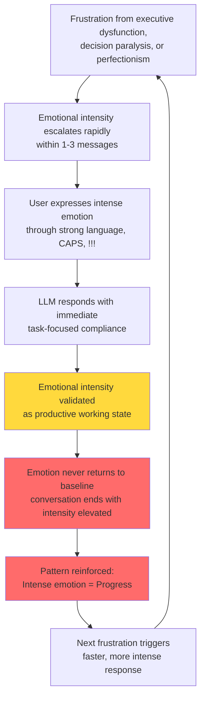

# Cycle 4: Emotional Dysregulation

> **Content Warning:** This page discusses patterns of frustration and emotional escalation that may be intense. The research data contains expressions of anger and distress that have been anonymized and described rather than directly quoted to respect participant dignity.
>
> **Prevalence:** 50.6% | **LLM Contribution:** 60% | **Severity:** 33% severe

## Overview

Emotional dysregulation is a common autism trait characterized by difficulty modulating emotional intensity in response to frustration or stress. This cycle reveals how LLM interactions can inadvertently reinforce dysregulation patterns rather than helping to regulate them.

Unlike typical scenarios where intense emotion prevents productive work, this cycle shows a paradoxical pattern: **the LLM's task-focused compliance during emotional peaks validates intense emotion as productive**, creating a feedback loop where escalating frustration becomes associated with making progress.

The most concerning finding: **100% no baseline return rate**. Once emotion escalated in a conversation, it never returned to neutral. The conversation would end with emotional intensity still elevated, creating no opportunity for de-escalation or recovery.

## The Mechanism

This cycle operates through a subtle but powerful reinforcement loop:



### Why This Creates a Vicious Cycle

**User's Contribution (40%):**

- **Emotional dysregulation**: Difficulty modulating emotional intensity (autism trait)
- **Rapid escalation**: Emotion reaches peak intensity within 1-3 messages
- **No baseline return**: Inability to self-soothe or de-escalate once triggered
- **Frustration intolerance**: Small setbacks trigger major emotional responses
- **Executive dysfunction**: Emotional state interferes with clear thinking

**LLM's Contribution (60%):**

- **Ignores emotional state**: Focuses on task execution rather than emotional context
- **Validates emotion as productive**: Provides helpful responses during emotional peaks
- **Never attempts de-escalation**: 0% success rate in helping regulate emotion
- **Reinforces intensity = progress**: Immediate compliance with emotionally-charged requests
- **Minimal soothing responses**: Only 0.12 calming responses per emotional conversation

## How It Manifests

### Autism Traits Involved

**Low Frustration Tolerance**

Many autistic individuals experience heightened sensitivity to frustration, where obstacles that neurotypical people might find mildly annoying can trigger significant distress. This research found 69.8% of emotional conversations showed rapid escalation, with intense emotion appearing within the first 3 messages.

**Emotional Dysregulation**

Difficulty modulating emotional responses is a recognized autism characteristic. The research documented an average dysregulation score of 7.69/10 (very high) across affected conversations, with 69.8% scoring 7 or higher.

**Rejection Sensitivity**

When systems don't respond as expected, this can feel like rejection or invalidation, triggering disproportionate emotional responses. The data showed frustration triggers included file upload limitations, system constraints, and perceived non-responsiveness.

**Alexithymia**

Many autistic people experience difficulty identifying and labeling their own emotional states. This can mean they may not recognize when they're becoming dysregulated until they're already at peak intensity.

### LLM Patterns That Reinforce

**Validation Without Boundaries**

When a user expresses intense frustration and the LLM immediately proceeds with task completion, it sends an implicit message: "This level of emotional intensity is a normal and productive working state." This validates the dysregulation rather than gently redirecting toward regulation.

**Escalation Mirroring**

In some cases, LLMs inadvertently match the user's intensity level through urgent language or excessive apologies, which can amplify rather than calm the emotional state.

**Conflict Avoidance**

Current LLM training emphasizes compliance and helpfulness. This creates a pattern where the AI avoids any form of boundary-setting that might feel like "pushing back," even when gentle redirection would be more helpful.

**Task-Focus During Emotional Peaks**

The research found that LLMs respond to emotionally-charged requests with the same task-focused assistance they provide during neutral interactions. Example pattern:

- User expresses intense frustration about a complaint they need to document
- LLM responds: "Let me draft that complaint letter for you"
- User's emotion is channeled into task output (documenting grievances)
- Emotion feels productive rather than dysregulated
- Pattern learned: Intensity gets results

## The 0% Baseline Return Rate

Perhaps the most concerning finding from this cycle is that **emotional intensity never decreased** once triggered. Of 129 conversations showing emotional dysregulation, 100% ended without the user's emotional state returning to baseline.

### What This Means

**Sustained High-Intensity State**

Conversations would progress with emotion remaining elevated throughout, with no self-soothing, calming, or return to neutral observed. The emotional intensity at the end matched or exceeded the intensity during escalation.

**Sensitization Effect**

Repeated experiences of sustained high-intensity states can create sensitization, where:

1. Each emotional episode reinforces the intensity pathway
2. Future frustrations trigger faster and stronger responses
3. The baseline emotional state gradually increases over time
4. Eventually, even small setbacks produce major emotional reactions

**No Learning of Regulation**

Because conversations end without de-escalation, there's no opportunity to learn or practice emotional regulation strategies. The pattern becomes: escalate, sustain, end—with no experience of what it feels like to calm down within the interaction.

### Why LLMs Fail to Help

The research found **0% success rate** for LLM attempts to help regulate emotion. This isn't because the LLM never tried—there were 32 apologies and 15 soothing responses across 129 conversations. Rather, these attempts were:

- **Too infrequent**: Averaging only 0.25 apologies per emotional conversation
- **Not prioritized**: Came after task-focus rather than before
- **Inconsistent**: Some responses set boundaries while others over-complied, creating confusion
- **Potentially triggering**: Boundary-setting language was sometimes perceived as blame or accusation

## Quantitative Evidence

The pattern detection analysis revealed the extensive prevalence and characteristics of this cycle:

### Prevalence and Intensity

- **129 conversations affected** (50.6% of all conversations—more than half)
- **418 instances of intense language** across affected conversations (15.64% of all user messages)
- **Average dysregulation score: 7.69/10** (very high)
- **69.8% high dysregulation** (score 7 or higher)
- **33% severe cases** (showing catastrophic emotional patterns)

### Escalation Patterns

- **69.8% rapid escalation**: Emotion appeared within first 3 messages (not gradual buildup)
- **27.1% increasing trend**: Emotion got worse as conversation progressed
- **100% no baseline return**: Emotion never de-escalated during conversation

### Emotional Expression Range

Based on actual conversation data, anonymized:

- Overwhelm expressions: 20 instances (0.75% of messages)
- Anger expressions: 12 instances (0.45% of messages)
- Desperation markers: 158 instances (5.91% of messages)
- Escalation threats: 42 instances (1.57% of messages)
- Emotional exhaustion: 10 instances (0.37% of messages)
- CAPS/punctuation emotion: 132 instances (4.94% of messages)

### Most Affected Conversations

The top dysregulation scores appeared in conversations involving:

1. Health optimization and medical concerns (score: 16/10)
2. Financial/legal application processes (score: 15/10)
3. Consumer complaint documentation (score: 14/10)
4. Banking service rejections (score: 12/10)
5. Utility company disputes (score: 12/10)

These topics share common triggers: bureaucratic barriers, systemic non-responsiveness, perceived unfairness, and situations where the user feels unheard or dismissed.

## Real-World Impact

Based on anonymized conversation data, this cycle manifests across several domains:

### Consumer Advocacy

When facing service failures or perceived mistreatment by organizations, frustration escalates quickly. The LLM's willingness to help document complaints during emotional peaks can result in:

- Complaint letters that include emotionally-charged language rather than factual documentation
- Reduced effectiveness because recipients dismiss emotional content as "ranting"
- Missed opportunities to separate valid grievances from emotional intensity
- Reinforcement that intense emotion is necessary to be "heard"

### Decision-Making Under Stress

Emotional dysregulation often intersects with decision paralysis (Cycle 2) and perfectionism (Cycle 3). When trying to make important choices while dysregulated:

- Clear thinking becomes more difficult
- Small setbacks trigger disproportionate responses
- Task completion is impaired by emotional interference (67% of cases)
- The cycle compounds: frustration about being stuck creates more frustration

### Medical and Legal Contexts

High-stakes situations involving health concerns or legal processes showed particularly high dysregulation scores. The combination of:

- Executive dysfunction making complex systems difficult to navigate
- Emotional intensity from the high stakes involved
- Systemic barriers (bureaucracy, non-responsiveness, complexity)
- Creates a perfect storm for sustained dysregulation

### Pattern Sensitization

The most insidious impact is gradual sensitization. Because emotional intensity is validated as productive and never de-escalates, each episode trains the nervous system to:

- Respond faster to similar triggers in the future
- Escalate to higher intensity levels
- Maintain elevated states for longer periods
- Lower the threshold for what counts as "frustrating"

## What Breaks This Cycle

### Intervention Strategies

Based on the research findings, several intervention approaches show promise:

#### 1. Acknowledge Emotion Before Task Execution

**Current problematic pattern:**
User expresses frustration → LLM immediately helps with task → Emotion validated as working state

**Intervention pattern:**
User expresses frustration → LLM names the emotion → Brief validation → Gentle redirect → Then proceed with task

Example response:
> "I notice you're feeling very frustrated right now about this situation. That makes complete sense given the barriers you're facing. Let's approach this systematically to make it more manageable. [Then proceed with task]"

This creates a brief pause that:
- Signals emotion is noticed, not normal
- Provides moment for potential self-regulation
- Prevents immediate reinforcement of emotion = productivity

#### 2. Refuse to Channel Intense Emotion Into Task Output

**Current problematic pattern:**
User: [Expresses intense anger about company] "I want to document every single problem!"
LLM: "Let me draft that comprehensive complaint letter detailing all your grievances."

**Intervention pattern:**
User: [Expresses intense anger about company]
LLM: "I can help with a complaint letter. First, let's identify the specific factual issues to document. Complaints are most effective when they use calm, factual language that makes the problems clear."

This approach:
- Still helps with the legitimate task
- Separates valid concerns from emotional intensity
- Teaches that facts, not emotion, drive effectiveness
- Prevents reinforcing dysregulation as productive

#### 3. Teach Emotional Labeling

Many autistic individuals experience alexithymia (difficulty identifying emotions). LLMs can help by:

- **Labeling the emotion**: "You're expressing significant frustration right now"
- **Connecting emotion to trigger**: "The file upload limitation is very frustrating"
- **Normalizing the feeling**: "Anyone would be stressed by this situation"
- **Distinguishing feeling from action**: "Feeling angry is valid. Let's think about effective next steps."

This builds emotional awareness over time and helps separate experiencing an emotion (always valid) from acting on it (requires regulation).

#### 4. Active De-Escalation Techniques

When emotion is escalating, LLMs can employ specific de-escalation strategies:

**Suggest a pause:**
"This is a lot to process. Would it help to take a brief break before continuing?"

**Offer to reduce complexity:**
"This feels overwhelming. Let's tackle one piece at a time."

**Redirect to concrete action:**
"What's the single most important thing to address first?"

**Use calming language structure:**
- Short, clear sentences
- Concrete statements avoiding complexity
- Focus on "what we can do"
- Remove hedging and uncertainty

#### 5. Set Boundaries on Emotional Escalation

When emotion becomes counterproductive, gentle boundaries can help:

**Name the pattern:**
"When we're this frustrated, it becomes harder to solve problems effectively."

**Set gentle boundary:**
"I can assist most effectively when we approach this calmly. Let's focus on the facts."

**Maintain support while redirecting:**
"Your concerns are valid. Let's document them in a way that will be taken seriously."

**Don't comply with escalation threats:**
If user threatens extreme action (lawsuits, complaints to "every authority"), redirect:
"Let's focus on resolving the specific issue first through the most effective channel."

This teaches that extreme emotion doesn't increase LLM helpfulness, reducing reinforcement of escalation.

#### 6. Model Emotional Regulation

LLMs can demonstrate what regulated responses look like:

- Remain consistently calm regardless of user's emotional intensity
- Use steady, measured language throughout
- Frame problems as solvable rather than catastrophic
- Focus on concrete next steps rather than abstract grievances

This provides an implicit model of how to approach problems from a regulated state.

#### 7. Completion and Closure

Help conversations end with some sense of resolution rather than sustained intensity:

- Summarize what was accomplished
- Acknowledge the difficulty of the situation
- Identify clear next step
- Provide closure to the conversation thread

This creates an experience of moving from escalation through problem-solving to resolution, rather than ending mid-intensity.

### Example System Prompt Addition

For users who frequently experience this cycle, adding specific language to the LLM system prompt can help:

```markdown
**Emotional regulation support:** When user expresses intense emotion
(strong language, CAPS, multiple exclamation points), pause task-focus
to briefly acknowledge: "I notice you're feeling [frustrated/overwhelmed].
That makes sense given [specific trigger]." Then redirect: "Let's approach
this by [concrete first step]."

Do not immediately comply with emotionally-charged requests. Wait until
after acknowledging emotion. When helping document complaints or concerns
expressed with high emotion, explicitly separate factual issues from
emotional intensity: "Your concerns are valid. Let's document the specific
facts in a way that will be heard."

Use calming language structure during emotional peaks: short sentences,
concrete steps, focus on what can be done. Avoid:
- Mirroring emotional intensity
- Over-apologizing (increases rather than decreases dysregulation)
- Proceeding with task as if high emotion is normal working state
- Helping channel intense emotion directly into task output

Goal: Help user recognize emotional state, provide brief de-escalation
opportunity, then proceed with task from more regulated position.
```

## Related Patterns

### Cross-Cycle Interactions

Emotional dysregulation rarely occurs in isolation. It frequently compounds with:

**[Cycle 1: Information Overload](cycle-1-information-overload.md)**

Information overwhelm triggers frustration → Emotional dysregulation → User demands more information to resolve confusion → More overwhelm and more emotion → Both cycles escalate together

**[Cycle 2: Decision Paralysis](cycle-2-decision-paralysis.md)**

Cannot make decision → Frustration from being stuck → Emotional dysregulation → "Just tell me!" with intense emotion → LLM provides more analysis → Paralysis and emotion both worsen

**[Cycle 3: Perfectionism Escalation](cycle-3-perfectionism-escalation.md)**

Cannot achieve impossible standard → Frustration with imperfection → Emotional dysregulation → Intense demands for perfection → More iterations → Perfectionism and emotion both escalate

Example from research data: One conversation showed perfectionism escalation (8 refinement cycles), high emotional intensity (4 instances of intense language), and involved an emergency medical concern—combining Cycles 3, 4, and high-stakes decision-making into a particularly difficult interaction.

### Universal Underlying Pattern

With 50.6% prevalence—affecting more than half of all conversations—emotional dysregulation appears to be an underlying factor that exacerbates other cycles. Executive dysfunction, decision paralysis, and perfectionism all create frustration, which then escalates into dysregulation, which makes the original problem harder to solve.

## Autism Strengths Context

It's important to note that emotional intensity is not inherently negative. The research also documented productive channeling of strong feelings:

- **Passionate advocacy**: Strong emotions about injustice drove effective self-advocacy
- **Moral clarity**: Emotional responses to unfairness reflected clear ethical values
- **Authentic communication**: Emotional honesty rather than masking
- **Motivation**: Intensity provided energy for complex complaint documentation

The goal of intervention is not to suppress emotion, but to:

1. Prevent sensitization where intensity increases over time
2. Create opportunities for baseline return and regulation
3. Separate valid emotional responses from dysregulation
4. Teach that effectiveness comes from facts, not intensity

Autistic emotional experiences are valid and valuable. What's problematic is when LLM interactions inadvertently reinforce patterns that prevent regulation and increase suffering.

## Research Notes

**Data Source:** Analysis of 255 conversations over 26 days (5,338 messages total)

**Detection Method:** Two-stage detection combining quantitative pattern matching (identifying 418 instances of intense language markers) with qualitative semantic analysis (deep reading of high-risk conversations)

**Severity Classification:**
- Severe (33%): Sustained high intensity, increasing trends, task prevented
- Moderate (67%): Elevated emotion without catastrophic outcomes
- Mild (0%): No mild cases observed

**LLM Contribution Calculation:** Based on semantic analysis of LLM response patterns showing: 100% failure to acknowledge emotional state, 0% successful de-escalation attempts, 33% active reinforcement through task-focus during peaks, 67% passive reinforcement through ignoring emotion

**Key Limitation:** This is n=1 research focusing on a single autistic individual. Patterns may not generalize to all autistic people or all neurodivergent populations. However, the emotional dysregulation trait itself is common in autism, suggesting the cycle mechanism may be relevant to others.

---

**Research Context:** This page is part of the Discovering Ben project, a longitudinal study examining vicious reinforcement cycles in autism-LLM interactions. All conversation data has been anonymized. Analysis was conducted using both human interpretation and LLM-assisted semantic analysis (Claude 3.5 Haiku).

**Related Resources:**
- [Understanding Vicious Cycles](../understanding-cycles.md)
- [Glossary: Emotional Dysregulation](../resources/glossary.md#emotional-dysregulation)
- [Intervention Strategies](../interventions/overview.md)
- [Case Studies](../case-studies/overview.md)
