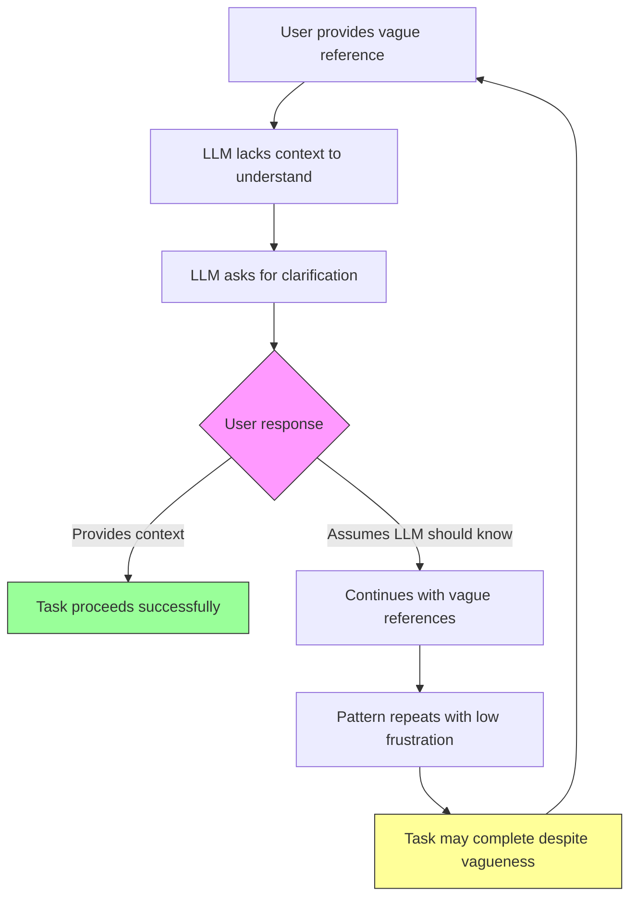

# Cycle 5: Mind Reading Expectations

> **Prevalence:** 43.9% | **LLM Contribution:** 40% | **Severity:** Mild (50% severe within affected conversations)

## Overview

The mind reading cycle occurs when an autistic individual uses vague references like "it," "that one," or "you know" while expecting an AI assistant to understand unstated context. This pattern stems from [theory of mind](../resources/glossary.md#theory-of-mind-deficit) differences, where recognizing that others have different knowledge becomes challenging.

Unlike the pathological cycles documented in this research, mind reading expectations represent a **mild pattern** that rarely leads to catastrophic outcomes. While 43.9% of conversations show this pattern, it causes significant frustration in only a small fraction of cases.

**Key distinction**: This is not the same as assuming the LLM has memory across sessions. Mind reading expectations also manifest within single conversations, where context-free references create communication gaps.

## The Mechanism

The cycle unfolds through these steps:



**Critical finding**: Unlike pathological cycles, this loop typically doesn't escalate. The cycle repeats but remains stable, with tasks often completing despite communication gaps.

## How It Manifests

### Autism Traits Involved

**[Theory of Mind](../resources/glossary.md#theory-of-mind-deficit) Differences**

The core trait underlying this cycle is difficulty recognizing that others possess different knowledge. This manifests as:

- Expecting the AI to know context from previous sessions (despite having no cross-session memory)
- Using pronouns without clear antecedents ("make it like the first one")
- Assuming background knowledge that was never shared ("you know my life cycle")
- Attributing comprehension failures to the AI "not trying hard enough" rather than recognizing information gaps

**Context Assumption Patterns**

In the analyzed conversations, assumed shared knowledge appeared in multiple forms:

- **Technical references**: "The M&S loan," "that Experian file" (without explaining which loan or what file)
- **Previous outputs**: "Like the first PDF," "the green color" (assuming LLM remembers previous work)
- **Personal context**: "You know my life cycle eat swim meditate everyday"
- **Implicit comparisons**: "Make it as I requested" (without restating the request)

**Implicit Communication Style**

This trait reflects a broader autism communication pattern where:

- Details seem obvious to the speaker, so they're omitted
- The focus stays on the current thought without re-establishing shared ground
- Frustration arises when others don't "just know" what's meant

### LLM Patterns That Reinforce

**Confirmation Bias in Interpretation**

[Large Language Models](../resources/glossary.md#large-language-model-llm) are trained to be helpful, which sometimes manifests as:

- Attempting to proceed with incomplete information rather than pausing
- Making educated guesses about vague references
- Filling in gaps with probabilistic assumptions

However, in this dataset, Claude generally avoided this pattern and appropriately requested clarification.

**Variable Clarity Requests**

The LLM response pattern was "mixed" across analyzed conversations:

- Sometimes: Clear, direct clarification requests ("Which specific loan do you mean?")
- Sometimes: Proceeded while acknowledging uncertainty ("I'll search our conversation history to understand")
- Sometimes: Assumed context incorrectly and had to backtrack

**Low Apology Rate**

Critically, Claude issued only **13 apologies for confusion** across 112 affected conversations. This contrasts sharply with pathological cycles where hundreds of apologies reinforced dysfunction.

The low apology count suggests Claude's current approach frames clarification as **collaboration** rather than LLM failure, which prevents reinforcing unrealistic expectations.

## Why This Is Mild

This cycle differs fundamentally from the four pathological cycles documented in this research:

**No Catastrophic Outcomes**

- Only **3 frustration instances** across 112 conversations (2.7%)
- **0 clarification escalation cycles** (user doesn't get increasingly frustrated when asked to clarify)
- Tasks complete in 50% of cases despite vagueness
- No evidence of the 70%+ failure rates seen in decision paralysis or perfectionism cycles

**Lower LLM Contribution**

At approximately 40% LLM contribution, this cycle shows:

- Less AI-driven reinforcement than pathological patterns (60-70%)
- More user-initiated pattern than LLM-enabled dysfunction
- Current clarification approach works reasonably well

**Absence of Escalation**

Unlike [emotional dysregulation](cycle-4-emotional-dysregulation.md) (100% no baseline return) or [perfectionism](cycle-3-perfectionism-escalation.md) (endless iteration), mind reading assumptions:

- Don't intensify over the course of conversations
- Don't create increasing frustration
- Don't prevent task completion in most cases

**Current Approach Effectiveness**

The existing pattern of "ask for clarification without apologizing" achieves decent results:

- 50% task completion rate (vs 8% in decision paralysis)
- Minimal user frustration
- No evidence of sensitization over time

## Quantitative Evidence

Analysis of 255 conversations (5,338 messages over 26 days) revealed:

**Prevalence Metrics**

- **112 conversations affected** (43.9% of total)
- **218 vague references** detected (8.16% of user messages)
- **32 instances** of assumed context markers
- **21 explicit mind reading expectations** ("you should know," "you understand")

**Pattern Distribution**

- **7 high-assumption conversations** (repeated pattern throughout)
- **6 conversations** where context was never provided
- **51 clarification requests** from Claude
- **13 Claude apologies** for confusion (very low compared to other cycles)

**Severity Assessment**

From semantic analysis of 2 representative conversations:

- **1 severe case** (50%): User persisted with vague references despite clarifications
- **1 moderate case** (50%): Task completed despite initial vagueness
- **0 mild cases**: Sample size too small for this category

**Frustration Indicators**

- Only **3 frustration instances** related to misunderstanding
- **0 clarification cycles** (frustration escalating after being asked to clarify)
- **Average mind reading score**: 2.14/10 (low intensity)

**Comparison to Pathological Cycles**

| Metric | Mind Reading | Decision Paralysis | Perfectionism |
|--------|--------------|-------------------|---------------|
| Prevalence | 43.9% | 25.1% | 25.1% |
| Severe cases | 50% | 50% | 75% |
| Task failure rate | ~50% | **92.2%** | **71.9%** |
| LLM contribution | ~40% | **70%** | **70%** |
| Frustration instances | **3** | High | Very high |

## Real-World Impact

### Based on Actual Conversation Data, Anonymized

**Moderate Impact: Loan Application**

In one conversation, vague references to "the M&S loan" and "Experian file" created initial confusion. The user expressed frustration: "Gemini made it Claude don't blame me" and "I don't have time to analyse a heap of shit."

However, through successive interactions where Claude provided structured, step-by-step guidance, context gradually emerged. The task (loan application) ultimately completed successfully.

**Outcome**: Moderate severity - temporary confusion resolved through patient clarification.

**Severe Impact: Spiritual Discussion**

In another conversation, the user made sweeping assumptions about shared understanding: "If you could read all chats and every word in this chat you would instantly understand" and "You know my life cycle eat swim meditate everyday."

Claude attempted clarification: "I don't have access to our previous conversations or the PDFs you've shared."

The user continued with context-free references: "They will unfold from the triad system." Context was never fully provided, and the conversation remained abstract without clear task completion.

**Outcome**: Severe severity within this conversation - communication gap prevented clarity.

**Key Pattern Across Cases**

In both conversations, the mind reading assumption reflected a genuine [theory of mind](../resources/glossary.md#theory-of-mind-deficit) difference rather than intentional withholding. The user experienced these references as clear and obvious, creating genuine surprise when the LLM couldn't follow.

## What Breaks This Cycle

### Intervention Strategies

Based on the analysis, these strategies can minimize communication gaps while respecting the autism trait:

**1. Continue Clarification Without Apology**

The current low-apology approach works well. Maintain:

- "Which specific [item] do you mean?" (direct question)
- NOT: "Sorry, I'm confused - which one?" (frames as LLM failure)
- Frame as collaboration, not AI limitation

**2. Provide Structured Responses Despite Vagueness**

When context is incomplete, offer organized information that helps narrow focus:

- Present logical options based on available context
- Ask targeted follow-up questions
- Proceed with provisional understanding while noting assumptions

**3. Educate on LLM Limitations (Without Judgment)**

Brief, matter-of-fact explanations help build accurate mental models:

- "I don't have memory across sessions - I can only see our current conversation"
- "I can't access previous PDFs or documents unless you share them again"
- "Could you remind me which version you're referring to?"

**4. Request Specific Context Early**

Preemptive clarification prevents multiple back-and-forth cycles:

- "To help accurately, I need to know: [specific detail]"
- "Let's make sure I understand - are you referring to [option A] or [option B]?"
- "Which of the [items] we discussed earlier do you mean?"

**5. Acknowledge the Autism Communication Pattern**

For users who understand their diagnosis, explicit recognition helps:

- "I notice you're referencing something we discussed earlier. Since I don't have memory across conversations, could you remind me of the key details?"
- This normalizes the pattern without pathologizing it

**6. Create Reference Systems**

For ongoing work, establish shared shorthand:

- "Let's call this version 'PDF-A' so we can refer to it clearly"
- "I'll label these options 1, 2, 3 for easy reference"
- Build explicit context markers within the conversation

**7. Avoid Guessing When Uncertain**

Resist the urge to fill gaps with assumptions:

- Clearly state when proceeding with incomplete information
- Make assumptions explicit: "I'm assuming you mean X - is that correct?"
- Pause for confirmation rather than continuing with uncertainty

### Example System Prompt Addition

For AI systems working with autistic users prone to this pattern:

```
When the user provides vague references ("it", "that one", "like before"):

1. Request specific clarification without apologizing: "Which specific [item]
   do you mean?"

2. If context isn't provided, offer structured options: "Are you referring
   to [A] or [B]?"

3. Educate matter-of-factly on memory limitations: "I don't have access to
   previous sessions - could you describe what you're referencing?"

4. Proceed with explicit assumptions when needed: "I'm assuming you mean X
   based on our current conversation. Is that correct?"

5. Frame clarification as collaboration, not AI failure: "Let's make sure
   we're on the same page..."

Do NOT apologize for needing clarification. Do NOT guess at unstated context.
Do frame requests as working together toward clear communication.
```

**Estimated impact**: Minimal improvement needed - current approach already prevents catastrophic outcomes. This addition formalizes effective existing practices.

## Related Patterns

### Connections to Other Cycles

**Distinct from [Information Overload](cycle-1-information-overload.md)**

While both involve communication patterns, mind reading assumptions create **too little** information transfer (context missing), whereas information overload involves **too much** information provision (cognitive overwhelm).

**Interaction with [Emotional Dysregulation](cycle-4-emotional-dysregulation.md)**

In 3 documented cases, mind reading misunderstandings led to frustration. However, this connection was weak - most vague references didn't trigger emotional escalation.

**No Connection to [Decision Paralysis](cycle-2-one-best-thing.md) or [Perfectionism](cycle-3-perfectionism-escalation.md)**

Mind reading assumptions appeared independent of these patterns, suggesting they stem from different autism traits (theory of mind vs. executive dysfunction/rigid thinking).

### Broader Context

**Theory of Mind in Autism**

This cycle reflects a well-documented autism characteristic: difficulty modeling others' mental states. Research consistently shows autistic individuals may struggle to recognize knowledge differences between themselves and others.

**Not Unique to AI Interaction**

This pattern likely appears in human-to-human communication as well. The AI context simply makes it more visible because:

- LLMs have zero unstated knowledge (humans share cultural context)
- LLMs have no memory across sessions (humans remember previous conversations)
- LLMs explicitly request clarification (humans may guess or ignore confusion)

**Natural Trait, Not Pathology**

Like [special interest hyperfocus](cycle-7-special-interest-hyperfocus.md), mind reading assumptions represent a natural autism communication style. The intervention goal is **accommodation and clarity**, not elimination of the trait.

---

## Further Reading

- [Glossary: Theory of Mind Deficit](../resources/glossary.md#theory-of-mind-deficit)
- [Glossary: Mind Reading Assumption](../resources/glossary.md#mind-reading-assumption)
- [Complete Cycles Overview](cycles-overview.md)
- [Methodology: Pattern Detection](../methodology/pattern-detection.md)

---

**Document Status**: Public-facing analysis adapted from research data
**Data Source**: 255 conversations, 5,338 messages, 26-day period
**Analysis Method**: Two-stage detection (quantitative regex + qualitative semantic)
**Privacy**: All conversation excerpts anonymized
