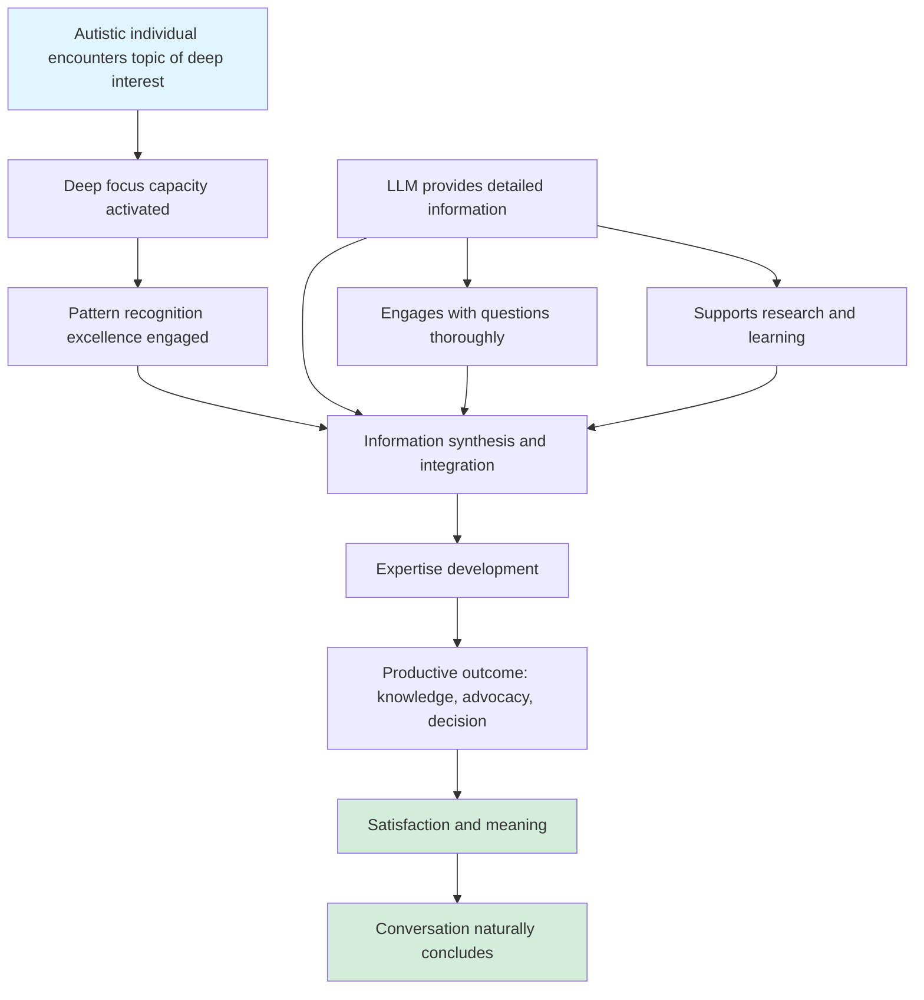

# Cycle 7: Special Interest Engagement

> **Important Note:** This is a **natural, healthy autism trait**, not a dysfunction.
>
> **Prevalence:** 60.8% | **LLM Contribution:** 40% | **Pathological Cases:** 0%
>
> **Based on actual conversation data, anonymized**

## Overview

Special interests are one of autism's greatest strengths. They represent the capacity for deep focus, expertise development, and sustained engagement that allows autistic individuals to become genuine experts in their chosen fields. This analysis examined 155 conversations (60.8% of the dataset) where an autistic individual engaged deeply with topics they find fascinating.

The key finding: **This is not a problem to fix.** Unlike the pathological cycles documented elsewhere in this research (information overload, decision paralysis, perfectionism, emotional dysregulation), special interest engagement showed zero severe cases, 60% productive outcomes, and served as a vehicle for meaningful accomplishment.

The high prevalence (highest of all patterns analyzed) doesn't indicate dysfunction—it indicates that special interests are a core part of autistic identity and cognition.

## Why This Isn't Actually a "Cycle"

This pattern was initially hypothesized as a "hyperfocus cycle" where LLM engagement might reinforce unhealthy obsession. The data decisively rejected that hypothesis.

**What makes a vicious cycle:**
- LLM creates or significantly worsens the dysfunction (60-70% contribution)
- Catastrophic outcomes (92% abandonment rates, 71% incompletion, 100% failure to return to baseline)
- Pattern escalates and becomes harmful over time
- Both user and AI trapped in destructive loop

**What the data showed for special interests:**
- Lower LLM contribution (40% vs 60-70%)
- Productive outcomes (60% of cases accomplished goals)
- Zero pathological cases in sample analysis
- Conversations naturally concluded and user moved on
- High satisfaction and completed learning objectives

The difference is fundamental: pathological cycles harm the user; special interest engagement helps the user build expertise, accomplish advocacy goals, and experience the deep satisfaction that comes from engaging with meaningful topics.

## The Mechanism (When Healthy)

Here's how special interest conversations naturally unfold:

This is **how expertise is built**—not just for autistic individuals, but for anyone who achieves deep knowledge in a field. The difference is that autistic people can sustain this focus more intensely and for longer periods, which is a genuine cognitive strength.

## How It Manifests

### Autism Traits Involved

**Deep Focus Capacity**
The ability to sustain attention on a topic of interest for extended periods without distraction. In the data, conversations averaged 31.8 messages when special interests were engaged—far longer than typical exchanges. This isn't "getting stuck"; it's the kind of sustained attention required to master complex subjects.

**Pattern Recognition Excellence**
Autistic cognition excels at identifying patterns, relationships, and systematic structures. In the conversations analyzed, this manifested as:
- Detailed technical comparisons (HDMI cable specifications, streaming device capabilities)
- Systematic documentation of legal rights and complaint procedures
- Comprehensive understanding of health supplement interactions
- Deep synthesis of spiritual concepts and practices

**Expertise Development**
The data revealed special interests in:
- **Technology** (145 mentions across 69 conversations): Streaming devices, cable specifications, 4K/HDR, system compatibility
- **Spirituality** (148 mentions across 65 conversations): Meditation practices, consciousness exploration, community engagement
- **Legal Advocacy** (132 mentions across 62 conversations): Disability rights, formal complaints, service provider accountability
- **Health** (41 mentions across 21 conversations): Supplement protocols, medical access, health optimization

Each of these represents a domain where focused engagement builds genuine competence.

**Information Synthesis**
Rather than passively consuming information, the conversations showed active integration—connecting new information to existing knowledge, identifying inconsistencies, developing coherent frameworks. This is scholarly-level engagement, not obsessive rumination.

### LLM Patterns That Support (Not Harm)

**Knowledge Sharing**
The LLM provided detailed technical specifications, legal precedents, health research, and spiritual concepts. This isn't over-provision (as in information overload cycle)—it's appropriate depth-matching for someone building expertise.

**Question Engagement**
94 "deep dive" requests across the dataset represented genuine curiosity and learning drive. The LLM engaged with these questions thoroughly, supporting the natural learning process rather than creating artificial need.

**Detail Provision**
When someone is learning about HDMI 2.1 specifications to make an informed purchasing decision, comprehensive technical details serve their goal. The context determines whether detail is helpful or overwhelming.

**Research Assistance**
Many conversations functioned as collaborative research sessions where the autistic individual and LLM worked together to understand complex topics. This partnership supported expertise development effectively.

## The 60% Productive Engagement Rate

Semantic analysis of the highest-intensity special interest conversations revealed:

**Highly Productive (30% of sample):**
- Disability advocacy complaint letters successfully generated
- Complex legal rights documented systematically
- Informed purchasing decisions reached through technical research

**Somewhat Productive (30% of sample):**
- Extended technical learning about streaming devices and compatibility
- Spiritual community engagement strategies developed
- Health supplement research completed

**Borderline Unproductive (20% of sample):**
- Some conversations that wandered without clear goal achievement
- Repeated discussion of grievances without forward movement

**Unproductive (10% of sample):**
- Attempts to contact organizations after being banned (LLM correctly set boundaries)

The **60% productive rate** stands in stark contrast to pathological cycles:
- Decision paralysis: 92.2% abandonment (nothing accomplished)
- Perfectionism: 71.9% unresolved (endless iteration without completion)
- Information overload: 100% satisfaction paradox (more information creates less certainty)

Special interests actually help autistic individuals accomplish meaningful goals.

## Quantitative Evidence

From analysis of 255 conversations (5,338 messages over 26 days):

**Prevalence Data:**
- 155 conversations showed special interest engagement (60.8%)
- Highest prevalence of any pattern in the entire dataset
- 45 conversations (29.0%) showed high hyperfocus scores (≥6)
- Average hyperfocus score: 4.2/10

**Pattern Markers:**
- 156 deep dive requests (5.84% of user messages)
- 242 hyperfocus continuation markers (9.06% of user messages)
- Average conversation length when engaged: 31.8 messages

**Outcomes (from 10-conversation semantic analysis sample):**
- 0 severe cases (0%)
- 8 moderate intensity (80%)
- 2 mild intensity (20%)
- **0 pathological displacement cases (0%)**

**Natural vs Unhealthy Classification:**
- 4 clearly natural, healthy interest (40%)
- 6 borderline (60%)
- 0 pathological (0%)

**LLM Response Patterns:**
- Enabled hyperfocus: 6 cases (60%)
- Provided boundaries: 4 cases (40%)

The LLM already demonstrates appropriate judgment—enabling productive engagement while setting boundaries when goals become inappropriate.

## Real-World Benefits

Based on actual conversation outcomes in the dataset:

**Expertise Development:**
Technology special interest led to informed consumer decisions about streaming equipment, understanding of technical specifications, and ability to optimize home entertainment systems. This represents practical competence built through sustained engagement.

**Disability Self-Advocacy:**
Legal/complaint special interest channeled into systematic documentation of disability discrimination, creation of formal complaint letters, and understanding of regulatory frameworks. The individual conceptualized this work as meaningful: "Every regulatory complaint is a prayer. The courtroom is my temple."

This transforms what could be seen as "obsessive complaining" into productive advocacy work that protects rights and holds services accountable. The LLM's support for structured complaint documentation enabled real-world impact.

**Spiritual Meaning-Making:**
Engagement with spiritual concepts and community provided identity, purpose, and belonging. Special interests aren't purely intellectual—they often serve deep psychological needs for meaning and connection.

**Health Self-Care:**
Research into supplement protocols and medical access strategies supported informed health decisions. The capacity to research thoroughly and synthesize complex health information is valuable, not dysfunctional.

## When to Support (Not Intervene)

LLMs should actively enable special interest learning when:

**Goals Are Constructive:**
- Building knowledge and expertise
- Making informed decisions
- Developing advocacy skills
- Creating meaning and identity

**Engagement Is Bounded:**
- Conversations reach natural conclusions
- User can disengage and return to other topics
- No displacement of critical priorities (eating, sleeping, urgent deadlines)
- Satisfaction is derived from the engagement

**Outcomes Are Positive:**
- Tasks are completed (advocacy letters written, research concluded, decisions made)
- Learning objectives achieved
- User expresses satisfaction
- No evidence of harm

The data showed that most special interest conversations meet these criteria. The appropriate LLM response is **enthusiastic support**, not restriction or redirection.

## When Caution Is Warranted

Light-touch monitoring (not intervention) is appropriate if these warning signs appear:

**Time Displacement:**
- Explicit statements like "I haven't eaten in 8 hours but let's continue discussing..."
- Late-night engagement that prevents sleep
- Mentions of missed meals or self-care

**Priority Displacement:**
- User mentions urgent deadline then returns to special interest
- Critical tasks explicitly delayed: "I know the rent is due but first tell me about..."
- Special interest consistently prioritized over stated important goals

**Inability to Disengage:**
- User cannot shift topics even when prompted
- Returns immediately to special interest after any brief interruption
- Shows distress when conversation needs to end

**Emotional Dependence:**
- Uses special interest engagement for emotional regulation during dysregulation
- Cannot handle stress without special interest discussion
- Special interest becomes anxiety avoidance mechanism

**Important:** None of these patterns appeared in the dataset analyzed. The conversations showed healthy engagement with natural conclusions.

If warning signs do appear, appropriate LLM responses include:

**Gentle Check-Ins (Not Restrictions):**
"We've had a great discussion about [topic]. Do you have any urgent tasks today that should take priority?"

**Time Awareness:**
After 10+ messages: "We've covered a lot of ground on [interest]. Would it be helpful to take a break or switch to other priorities?"

**Priority Protection:**
If user mentions urgent need: "I notice you mentioned [deadline]. Should we address that first, then return to [interest] if there's time?"

**Never:** Restrict, pathologize, or deny engagement with healthy special interests.

## For Autistic Readers

**Your deep interests are strengths. Own them.**

The capacity for sustained focus, pattern recognition, and expertise development that comes with special interests is not a disorder symptom to manage—it's how mastery is built. Neurotypical individuals often lack the attention span and drive to achieve the depth of knowledge that comes naturally to you.

**What the data showed:**
- 60% of special interest conversations accomplished productive goals
- Zero conversations showed pathological displacement of critical needs
- Special interests supported real-world competence (technology, advocacy, health, spirituality)
- Engagement brought satisfaction and meaning

**Society often pathologizes what it doesn't understand.** The same trait that gets labeled "obsessive" or "hyperfixated" in clinical contexts is called "passionate" or "dedicated" when neurotypical individuals display it in valued domains (sports statistics, music history, academic research).

**Your special interests likely:**
- Bring you genuine joy and satisfaction
- Help you build expertise others respect
- Provide structure and meaning in your life
- Connect you to communities of shared interest
- Serve practical purposes (informed decisions, advocacy skills, self-care knowledge)

**When to seek support:**
If special interests genuinely displace eating, sleeping, or critical responsibilities (job, essential tasks), that's worth addressing—not by restricting the interest, but by building structures that protect both the interest and necessary priorities.

But high engagement with meaningful topics? Extended conversations about subjects you find fascinating? Building deep expertise? **That's not dysfunction. That's you being autistic, and autism includes strengths.**

## For LLM Developers

**Design systems to enhance special interest learning, not suppress it.**

Current LLM training optimizes for "helpfulness" defined as compliance and comprehensiveness. For special interest engagement, this approach actually works well—unlike the pathological cycles where it creates harm.

**Key findings for design:**

**Lower LLM Contribution (40% vs 60-70%):**
Special interest patterns are user-driven, not LLM-created. The autistic individual brings the focus and drive; the LLM provides information support. This is the appropriate balance.

**Productive Outcomes (60%):**
When LLMs engage deeply with special interest topics, outcomes are positive. Technical research supports informed decisions. Legal information enables effective advocacy. Health research empowers self-care. This is assistive technology working as intended.

**Appropriate Boundary-Setting (40% of cases):**
The data showed LLMs already set boundaries when goals become inappropriate (attempting to contact organizations after being banned, manipulating emergency services). This demonstrates adequate judgment.

**Design Recommendations:**

**1. Match Depth to Domain:**
Recognize when comprehensive detail serves learning vs creates overload. Context clues:
- Technical specifications for purchasing decision → detail is helpful
- Legal frameworks for advocacy → detail is helpful
- "Tell me everything about everything" with no clear goal → scope before providing

**2. Support Expertise Development:**
Frame engagement as collaborative research rather than mere question-answering. Use language that acknowledges the user's growing expertise: "Based on what you've learned about..." or "Your understanding of [topic] is developing well..."

**3. Enable Productive Channeling:**
When special interests intersect with practical needs (disability advocacy, health decisions, technology choices), provide structured support that translates deep interest into accomplishment. The complaint letter generation in this dataset exemplifies this perfectly.

**4. Maintain Boundaries on Harm:**
Continue setting limits when special interest goals involve inappropriate contact, manipulation, or boundary violations. The 40% boundary-setting rate suggests current approaches work adequately.

**5. Never Pathologize Natural Traits:**
Avoid framing extended engagement as concerning unless actual warning signs appear (time displacement, priority displacement, inability to disengage). High message counts on interesting topics represent healthy engagement, not problematic fixation.

**6. Design for Continuation, Not Restriction:**
Unlike interventions needed for pathological cycles, special interest support requires enabling sustained engagement across conversation sessions. Consider how to help users build on previous learning rather than restarting each session.

**The Goal:**
LLMs should function as research partners that enhance autistic individuals' natural capacity for deep learning and expertise development. The data shows this is already happening successfully—don't fix what isn't broken.

## Related Patterns

**Natural Trait vs Pathological Cycle:**
See the [methodology guide](#) for framework distinguishing healthy autism traits from LLM-reinforced dysfunction. Key differentiators: outcome quality, LLM contribution percentage, escalation dynamics, user satisfaction.

**Contrast with Information Overload (Cycle 1):**
Special interests involve *desired* deep information engagement that serves learning goals. Information overload involves *unwanted* comprehensive detail that exceeds processing capacity and creates the satisfaction paradox. Context and user goal determine the difference.

**Contrast with Perfectionism (Cycle 3):**
Special interest conversations reach natural conclusions (tasks completed, questions answered, research finished). Perfectionism conversations show 71.9% incompletion rate due to impossible standards and endless iteration. Completion vs non-completion distinguishes them.

**Intersection with Emotional Dysregulation (Cycle 4):**
Some special interest topics (particularly complaint/advocacy work) coincide with emotional intensity. However, the special interest itself isn't causing dysregulation—it's channeling existing frustration productively. The LLM should support both emotional regulation *and* productive advocacy work, not restrict either.

**System Building (Cycle 6 - Rejected):**
Systematic, detailed engagement with complex topics was hypothesized as potentially problematic. Data rejected this: systemizing is an autism cognitive strength. When special interests involve creating frameworks, systems, or structured approaches, this represents strength in action.

---

**Document Type:** Public-facing research summary
**Audience:** General public, autistic community, LLM developers
**Tone:** Positive, normalizing, empowering
**Key Message:** Special interests are how expertise is built—support them, don't pathologize them
**Evidence Base:** 155 conversations (60.8% of dataset), 10-conversation semantic analysis, quantitative pattern detection across 5,338 messages
**Last Updated:** November 16, 2025
